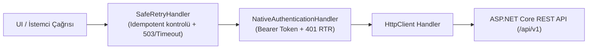

# API İstemci Katmanı ve Çevrimdışı Engel Tasarımı

Bu belge, **Faz 12 (F12-G03)** kapsamında Windows ve Android istemcileri için geliştirilen API istemci katmanını, RFC 9457 Problem Details hata eşlemesini, güvenli yeniden deneme (Safe Retry) politikasını, Bearer token delegating handler'ını ve "bağlantı gerekli" çevrimdışı engeli mimarisini açıklar.

---

## 1. Mimari Prensipler

1. **Katı Çevrimdışı Yazma Yasağı:** Sağlık sistemlerinde çevrimdışı kuyruğa yazılan klinik order, ilaç istemi veya randevu verileri, senkronizasyon sırasında geri döndürülemez yarış durumları (race conditions), mükerrer reçeteleme veya yetkisiz işlem riskleri doğurur. Sistem **asla yerel çevrimdışı yazma kuyruğu tutmaz**; ağ yoksa kullanıcıya açıkça **"Bağlantı Gerekli"** durumu gösterilir ve yazma işlemleri anında engellenir.
2. **Yalnızca Güvenli / Idempotent İsteklerde Yeniden Deneme:** `SafeRetryHandler` yalnızca `GET`, `HEAD`, `OPTIONS`, `PUT`, `DELETE` gibi güvenli/idempotent HTTP metotlarını veya istek başlığında açıkça `Idempotency-Key` / `X-Idempotency-Key` bulunan işlemleri geçici ağ/503 hatalarında yeniden dener. Idempotency anahtarı bulunmayan standart `POST` ve `PATCH` istekleri **asla otomatik olarak yeniden denenmez** (mükerrer kayıt/finansal işlem riskine karşı koruma).
3. **RFC 9457 / RFC 7807 Problem Details Eşleme:** Sunucudan dönen hata yanıtları (`ProblemDetailsDto`) güvenli bir şekilde ayrıştırılır; dahili sunucu ayrıntıları veya hassas hata yığınları (stack trace) kullanıcıya veya loglara sızdırılmadan standart `ApiException` nesnesine dönüştürülür.
4. **Şeffaf Token Yenileme (RTR):** `NativeAuthenticationHandler`, `401 Unauthorized` yanıtı aldığında `INativeTokenRefreshService` aracılığıyla yeni bir access token alır ve isteği yeni token ile bir defaya mahsus şeffaf olarak tekrarlar. Refresh başarısız olursa oturum derhal sonlandırılır.

---

## 2. API İstemci DelegatingHandler Boru Hattı



### Boru Hattı Bileşenleri

- **`SafeRetryHandler`:**
  - `IsRequestSafeOrIdempotent(HttpRequestMessage)` kontrolü yapar.
  - Geçici durum kodları (`503 Service Unavailable`, `504 Gateway Timeout`, `408 Request Timeout`) veya bağlantı kopmasında üstel geri çekilme (exponential backoff) ile azami 2 kez yeniden dener.
  - İstemci hatalarında (`400`, `401`, `403`, `404`) yeniden deneme yapmaz.
- **`NativeAuthenticationHandler`:**
  - `IAppSecureStorage` üzerinden mevcut access token'ı okur ve `Authorization: Bearer <token>` başlığı ekler.
  - `401 Unauthorized` durumunda `RefreshAccessTokenAsync` çağırarak Refresh Token Rotation çalıştırır.
  - Başarılı olursa isteği yeni token ile tekrarlar; aksi halde `InvalidateSessionAsync` tetikler.
- **`ApiClientJsonHelper`:**
  - `EnsureSuccessOrThrowProblemDetailsAsync`: Başarısız HTTP yanıtlarını RFC 9457 formatında ayrıştırarak alan bazlı doğrulama hatalarını içeren `ApiException` fırlatır.

---

## 3. Bağlantı Durumu ve Çevrimdışı Engel Bileşeni (`ConnectionRequiredState.razor`)

İnternet veya yerel ağ bağlantısı kesildiğinde, `HospitalManagement.UI.Components.ConnectionRequiredState` bileşeni devreye girer:

- **Erişilebilirlik:** `role="alert"` ve `aria-live="assertive"` ile ekran okuyuculara bağlantı kesintisini öncelikli bildirir.
- **Güvenlik Uyarısı:** `"Klinik veri güvenliği ve hasta güvenliği gereği sistem çevrimdışı çalışmayı desteklemez. Lütfen internet veya hastane yerel ağ bağlantınızı kontrol ediniz."` metni açıkça gösterilir.
- **Yeniden Deneme:** `IPlatformConnectivityService.CheckConnectivityAsync()` çağrısıyla bağlantıyı test eder; ağ geri geldiğinde `OnConnectionRestored` olayını tetikler.

---

## 4. Test Doğrulamaları

```powershell
# SafeRetryHandler, NativeAuthenticationHandler ve Problem Details testleri
dotnet test tests/HospitalManagement.ComponentTests/HospitalManagement.ComponentTests.csproj -c Release --filter "Category=Component"
```
