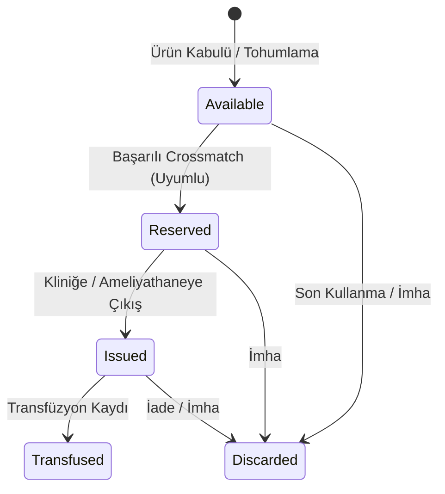

# Kan Bankası ve İmmünohematoloji Dikey Dilimi (F06-G09)

Bu doküman, Tanısal Hizmetler modülü altındaki **Kan Bankası ve İmmünohematoloji Dikey Dilimi (F06-G09)** bileşeninin mimarisini, veri modelini, deterministik crossmatch uygunluk simülasyonunu ve stok yaşam döngüsü kurallarını açıklar.

## 1. Mimari ve Amaç

Kan bankası dikey dilimi, hastane ortamında kan ürünlerinin (Eritrosit Süspansiyonu, Taze Donmuş Plazma, Trombosit vb.) stok takibini, hekim istemleri doğrultusunda crossmatch uygunluk testini, ünite rezervasyonunu, kliniğe çıkışını ve transfüzyon kaydını yönetir.

> [!WARNING]
> **Eğitim ve Simülasyon Kapsamı:** Bu sistem gerçek klinik uygunluk veya kan transfüzyon kararı iddiası taşımaz. Tüm veriler sentetik `DEMO` verisidir ve crossmatch testleri deterministik algoritmalarla simüle edilmektedir.

---

## 2. Kan Ürünü Yaşam Döngüsü

Bir kan ünitesi (`BloodUnit`) aşağıdaki durum aşamalarından geçer:

---

## 3. Deterministik Crossmatch Uygunluk Matrisi

`BloodCompatibilityMatrix` sınıfı standart immünohematoloji kurallarını deterministik olarak simüle eder:

- **Eritrosit Süspansiyonu (RBC) & Tam Kan**:
  - `0 Rh(-)`: Evrensel eritrosit donörüdür; tüm alıcı grupları (`A+`, `A-`, `B+`, `B-`, `AB+`, `AB-`, `0+`, `0-`) ile uyumludur.
  - `AB Rh(+)`: Evrensel eritrosit alıcısıdır.
  - Uyumsuz eşleşmeler (ör. `A Rh(+)` ünite `B Rh(+)` hastaya verilmek istendiğinde) deterministik olarak reddedilir (`Incompatible`), ünite rezerve edilmez ve audit günlüğüne `Diagnostics.BloodBankCrossmatchIncompatible` olarak işlenir.
- **Taze Donmuş Plazma (FFP)**:
  - `AB`: Evrensel plazma donörüdür.

---

## 4. Güvenlik, İzolasyon ve Denetim İzi (Audit)

1. **Hasta IDOR Güvenliği**: Hastalar yalnızca kendi adlarına açılmış crossmatch taleplerini görebilir; diğer hastaların veya genel stokların detaylarına erişemez.
2. **Denetim İzi (Audit)**: Tüm talep oluşturma, crossmatch testi, ünite çıkışı ve transfüzyon işlemleri `Diagnostics.BloodBankCrossmatchRequest`, `Diagnostics.BloodBankCrossmatchIncompatible`, `Diagnostics.BloodBankCrossmatchCompatible`, `Diagnostics.BloodBankUnitIssue` ve `Diagnostics.BloodBankTransfusionRecord` olayları ile denetlenir.
