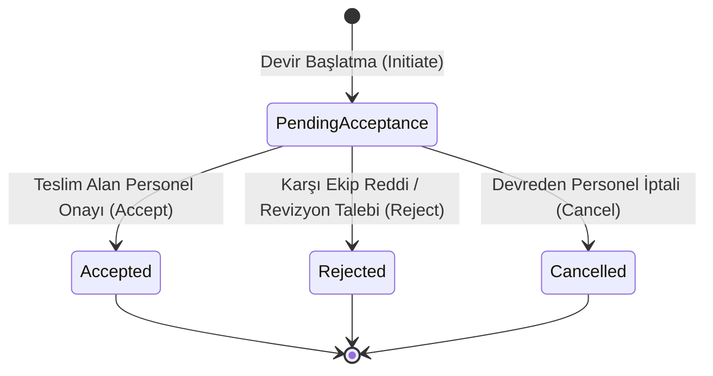

# Alanlar Arası Klinik Devir Teslim (Cross-Department Clinical Handoff / ISBAR)

Bu doküman, Faz 8 kritik alanlar kapsamında acil servis, ameliyathane (PACU), yoğun bakım ve yataklı servisler arasındaki hasta transferlerinde kullanılan yapılandırılmış ISBAR klinik devir teslim modelini, sahiplik kurallarını ve denetim izini açıklar.

## 1. Amaç ve Klinik Sorumluluk İlkesi

- **Modül:** `HospitalManagement.Modules.SurgeryCriticalCare`
- **Sahiplik Belirsizliğini Önleme:** Hasta bir alandan diğerine devredilirken, devir teslim kaydı `PendingAcceptance` (Kabul Bekliyor) durumundadır. Karşı ekibin yetkili personeli (hekim veya hemşire) devir teslimi `Accepted` statüsüne geçirene kadar hastanın klinik sorumluluğu devreden kaynak birimdedir.
- **Karşı Ekip Onayı:** Devreden personel kendi devir teslimini tek taraflı kabul edemez (`409 Conflict` / `InvalidOperationException`); teslim alan taraftan doğrulama zorunludur.

## 2. ISBAR Yapısı

| Harf | Bölüm | Anlamı ve İçeriği |
| :--- | :--- | :--- |
| **I** | **Identification** | Hasta kimliği, devreden ve devralan personel, kaynak ve hedef alan bilgisi |
| **S** | **Situation** | Mevcut klinik durum, sevk/transfer nedeni, aciliyet |
| **B** | **Background** | Tıbbi geçmiş, komorbiditeler, alerjiler, uygulanan cerrahi/majör tedaviler |
| **A** | **Assessment** | Vital bulgular, son laboratuvar/kan gazı sonuçları, invaziv hatlar (arter hat, santral kateter, drenler) |
| **R** | **Recommendation** | Açık bakım hedefleri, bekleyen order/ilaç saatleri, kontrol tetkikleri |

## 3. Devir Teslim Yaşam Döngüsü ve Statü Makinesi

- **Mükerrer Devir Koruması:** Aynı hasta için sistemde açıkta bekleyen (`PendingAcceptance`) ikinci bir devir başlatılamaz (`409 Conflict`).
- **Ret ve İptal Gerekçesi:** `Reject` ve `Cancel` işlemlerinde gerekçe metni girilmesi zorunludur.

## 4. Yetkilendirme ve Denetim İzi (Audit)

- **Yetkilendirme:**
  - Devir başlatma, kabul etme, reddetme, iptal: `HospitalPermissions.Inpatient.CriticalCareRecord` (`Doctor`, `Nurse`, `ChiefMedicalOfficer`).
  - Sistem yöneticisi (`SystemAdministrator`) klinik devir teslim işlemlerini yürütemez (`403 Forbidden`).
- **Audit Olayları:**
  - `Surgery.ClinicalHandoffInitiate`
  - `Surgery.ClinicalHandoffAccept`
  - `Surgery.ClinicalHandoffReject`
  - `Surgery.ClinicalHandoffCancel`

## 5. API Uç Noktaları

| Metot | Yol | İzin | Açıklama |
| :--- | :--- | :--- | :--- |
| `POST` | `/api/v1/clinical-handoffs` | `critical-care.record` | Yeni ISBAR devir teslim başlatır |
| `POST` | `/api/v1/clinical-handoffs/{id}/accept` | `critical-care.record` | Devir teslimi karşı ekip adına onaylar ve devralır |
| `POST` | `/api/v1/clinical-handoffs/{id}/reject` | `critical-care.record` | Devir teslimi gerekçe belirterek reddeder |
| `POST` | `/api/v1/clinical-handoffs/{id}/cancel` | `critical-care.record` | Başlatılan devir teslimi iptal eder |
| `GET` | `/api/v1/clinical-handoffs/pending` | Oturum Açmış Kullanıcı | Onay bekleyen devir teslimleri listeler |
| `GET` | `/api/v1/clinical-handoffs/patient/{patientId}` | Oturum Açmış Kullanıcı | Hastanın devir teslim geçmişini getirir |
| `GET` | `/api/v1/clinical-handoffs/{id}` | Oturum Açmış Kullanıcı | Devir teslim detayını getirir |

## 6. Doğrulama ve Testler

- **Birim Testleri (`ClinicalHandoffDomainTests.cs`):** ISBAR alan doğrulaması, tek taraflı kabul engellemesi, ret ve iptal kuralları, mükerrer devir engellemesi.
- **Bileşen Testleri (`ClinicalHandoffComponentTests.cs`):** ISBAR panosu render'ı, güvenlik ve sorumluluk banner'ı, aksiyon butonları, hedef birim filtreleri.
- **Entegrasyon Testleri (`ClinicalHandoffIntegrationTests.cs`):** Gerçek PostgreSQL üzerinde Devir Başlatma -> Bekleyenler listesi -> Kendi kendine onay reddi -> Karşı ekip onayı -> İkinci hasta için ret akışı -> Yetkisiz erişim kontrolü.
