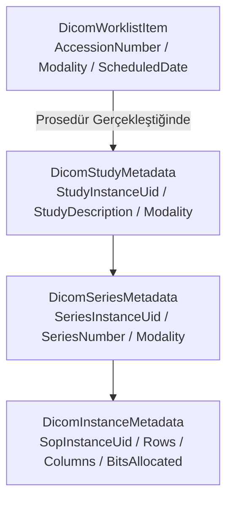

# DICOM Modality Worklist (MWL) ve PACS Entegrasyon Sözleşmesi (DICOM MWL & PACS Contract)

## 1. Amaç ve Kapsam

Bu belge, **Faz 10 — Mock entegrasyonlar ve birlikte çalışabilirlik** kapsamında `F10-G04 — DICOM worklist/PACS kontratı` görevinin teknik mimarisini, DICOM Modality Worklist (MWL / C-FIND) sorgulama ve randevu oluşturma sözleşmelerini, PACS çalışma/seri/görüntü meta veri hiyerarşisini ve cihaz çevrimdışı (offline) / hata simülasyonunu açıklar.

Radyoloji modaliteleri (CT, MR, XR, US vb.) ve PACS görüntü arşivleme sunucuları ile iletişim, gerçek cihaz veya soket bağımlılığı olmaksızın DICOM standartlarına (DICOM PS 3.4 / C-FIND) uyumlu veri modelleri ve `IIntegrationMockEngine` portu üzerinden simüle edilir.

> [!IMPORTANT]
> **Sentetik Görüntü ve Meta Veri Güvencesi:** Tüm DICOM UID'leri (`1.2.840.10008...DEMO...`), hasta kimlikleri (`DEMO-PAT-...`) ve görsel referansları sentetiktir. Canlı PACS sunucularına veya görüntüleme cihazlarına gerçek ağ çağrısı yapılmaz.

---

## 2. DICOM Veri Modelleri ve Hiyerarşisi

### 2.1 Desteklenen Modaliteler (`Modality`)
- `CT`: Bilgisayarlı Tomografi (Computed Tomography)
- `MR`: Manyetik Rezonans Görüntüleme (Magnetic Resonance)
- `XR`: Röntgen / Direkt Radyografi (X-Ray / Projection Radiography)
- `US`: Ultrasonografi (Ultrasound)

### 2.2 Worklist Durumları (`DicomWorklistStatus`)
- `Scheduled`: Cihaz iş listesine planlanmış randevu
- `InProgress`: Tetkik çekimi cihazda başlatıldı
- `Completed`: Görüntüleme tamamlandı, PACS'a aktarıldı
- `Discontinued`: Tetkik iptal edildi

---

## 3. Mock Motoru Entegrasyonu ve Hata Simülasyonu

- **Çevrimdışı Modalite Simülasyonu:** `FaultInjectionMode.Offline` seçildiğinde, cihaz veya PACS arşivi yanıt vermez (`500` / `Dış sistem çevrimdışı` simülasyonu).
- **Gecikme ve Zaman Aşımı:** Yüksek çözünürlüklü seri aktarımları için yapılandırılan gecikme süresi (`LatencyMilliseconds`) uygulanır.
- **Devre Kesici (Circuit Breaker):** Art arda gelen başarısız DICOM çağrılarında devre kesici açılarak sonraki istekler korumaya alınır.

---

## 4. API Uç Noktaları

| Metot | Yol | Açıklama |
|---|---|---|
| `GET` | `/api/v1/interoperability/dicom/worklist` | Modality Worklist (C-FIND) sorgusu (modalite, tarih ve AE Title filtreleme) |
| `POST` | `/api/v1/interoperability/dicom/worklist` | Yeni bir radyoloji tetkik iş listesi randevusu oluşturur |
| `GET` | `/api/v1/interoperability/dicom/studies/{studyInstanceUid}` | PACS çalışma, seri ve görüntü meta veri ağacını getirir |
| `GET` | `/api/v1/interoperability/dicom/patients/{patientId}/studies` | Belirtilen hastaya ait tüm PACS radyoloji çalışmalarını listeler |

---

## 5. Doğrulama ve Testler

- **Birim Testleri (`DicomPacsDomainTests`):** DICOM iş listesi nesne başlatma, Study -> Series -> Instance hiyerarşik meta veri doğrulaması, durum enum geçişleri.
- **Entegrasyon Testleri (`DicomPacsIntegrationTests`):** PostgreSQL üzerinde modalite bazlı MWL C-FIND filtreleme, yeni tetkik siparişi oluşturma, PACS çalışma ağacı sorgulama, `Offline` modunda hatanın yakalanması ve devre kesici sıfırlama.
