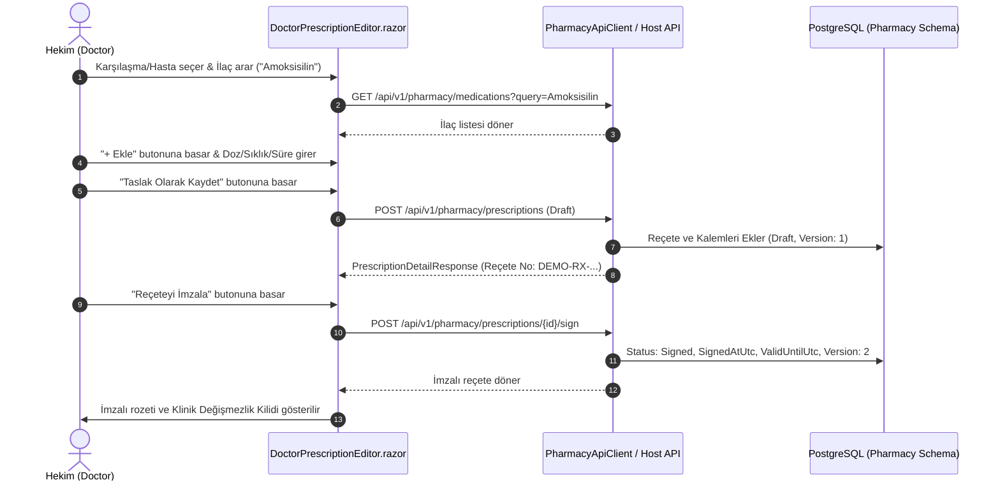

# Doktor Reçete Ekranı ve Kullanıcı Arayüzü (Doctor Prescription UI & Workflow - F05-G03)

Bu belge, **Faz 5: Reçete, Eczane ve Klinik Stok** aşamasının `F05-G03 — Doktor reçete ekranı` görevi kapsamında geliştirilen Blazor kullanıcı arayüzünü, ilaç kataloğu arama deneyimini, doz/kullanım talimatı belirleme kontrollerini, taslak kaydetme, dijital imzalama ve gerekçeli iptal akışlarını açıklar.

---

## 1. Mimari ve Bileşen Yapısı

- **Sayfa Bileşeni:** `DoctorPrescriptionEditor.razor` (`src/HospitalManagement.Web.Client/Pages/Doctor/DoctorPrescriptionEditor.razor`)
- **Rotalar:**
  - `/doctor/prescriptions` (Genel hekim reçete çalışma ekranı)
  - `/doctor/prescriptions/{EncounterId:guid}` (Belirli bir poliklinik karşılaşmasına doğrudan bağlı reçete ekranı)
- **İstemci Servis Arayüzü:** `IPharmacyApiClient` (`src/HospitalManagement.Web.Client/Pharmacy/IPharmacyApiClient.cs`)
- **İstemci Servis Uygulaması:** `PharmacyApiClient` (`src/HospitalManagement.Web.Client/Pharmacy/PharmacyApiClient.cs`)
- **Oturum ve Yetki:** `UserSessionState` (`IsDoctor` / `IsInRole("Doctor")` / `IsInRole("ChiefMedicalOfficer")`)

---

## 2. Kullanıcı Deneyimi ve Akışlar

---

## 3. Güvenlik ve Klinik Değişmezlik Garantileri

1. **Yetkisiz Erişim Koruması:**
   - Sayfa yalnızca `Doctor` veya `ChiefMedicalOfficer` rolüne sahip hekimlere açılır. Yetkisiz roller (örn: Hasta, Kayıt Personeli) `<ForbiddenState />` bileşeni ile engellenir.
2. **İmzalı Reçete Kilidi (Immutability Lock):**
   - Reçete imzalandığında (`Signed`) tüm ilaç kalemleri ve talimat alanları salt-okunur (`readonly/disabled`) hale gelir.
   - İlaç arama ve kalem ekleme/çıkarma panelleri gizlenir.
   - "Klinik Değişmezlik Bildirimi" banner'ı görüntülenir.
3. **Gerekçeli İptal Diyaloğu:**
   - İmzalı bir reçeteyi iptal etmek isteyen hekime zorunlu iptal gerekçesi girmesi gereken modal diyalog sunulur.
   - Gerekçe belirtilmeden iptal onayı butonu aktifleşmez.

---

## 4. Test Kapsamı ve Doğrulama

- **Bileşen Testleri (bUnit):** `DoctorPrescriptionEditorComponentTests.cs` (4 test)
  - Taslak formu ve arama alanının doğru render edilmesi.
  - İlaç araması yapılması ve sonuçtan kalemin reçeteye eklenmesi.
  - Taslak kaydetme ve reçeteyi imzalama akışında rozet ve kilit geçişleri.
  - Yetkisiz (Hasta) kullanıcı girişinde `ForbiddenState` gösterilmesi.
- **Tüm Süit:** 262/262 test %100 Başarılı.
