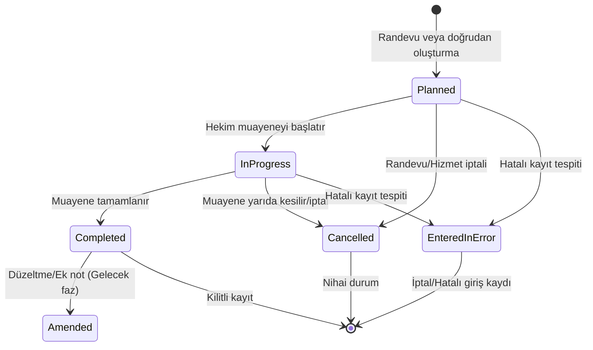

# Karşılaşma Modeli ve Yaşam Döngüsü (F04-G01)

Bu belge, **Faz 4: Klinik Kayıtlar ve Karşılaşma Yönetimi** kapsamındaki ilk görev olan `F04-G01 — Karşılaşma modeli` tasarımını, durum geçiş kurallarını, yetkilendirme ilkelerini ve veri bütünlüğü garantilerini özetler.

---

## 1. Mimari Genel Bakış

- **Modül:** `HospitalManagement.Modules.ClinicalRecords`
- **Şema:** `clinical_records`
- **Migration Geçmiş Tablosu:** `__EFMigrationsHistory_ClinicalRecords`
- **Aggregate Root:** `Encounter` (`src/Modules/ClinicalRecords/Domain/Encounter.cs`)
- **Alt Varlık:** `EncounterParticipant` (`src/Modules/ClinicalRecords/Domain/EncounterParticipant.cs`)

---

## 2. Durum Makinesi (State Machine)

Karşılaşmalar aşağıdaki durumlar üzerinden yönetilir:

### Durum Açıklamaları
1. **`Planned` (Planlandı):** Randevu ile oluşturulmuş veya hekim çalışma listesine planlanmış karşılaşma.
2. **`InProgress` (Devam Ediyor):** Hekim tarafından fiilen başlatılmış aktif muayene. Katılımcı sağlık personeli bu aşamada eklenebilir/çıkarılabilir.
3. **`Completed` (Tamamlandı):** Muayene ve klinik değerlendirme tamamlanmış ve kapatılmıştır. Doğrudan silinemez veya sessizce güncellenemez.
4. **`Cancelled` (İptal Edildi):** Hizmet verilmeden önce veya sırasında gerekçeli olarak iptal edilen karşılaşma.
5. **`EnteredInError` (Hatalı Giriş):** Yanlış hasta veya hatalı kayıt durumlarında gerekçeli olarak işaretlenen durum.

---

## 3. Katılımcı Yönetimi (Encounter Participants)

Her karşılaşma oluşturulduğunda sorumlu hekim otomatik olarak `PrimaryAttending` rolüyle katılımcı listesine eklenir. Muayene sürecinde diğer sağlık çalışanları (ör. konsültan hekim `Consulting`, yardımcı hemşire `AssistingNurse`) eklenebilir ve ayrılış zamanları (`LeftAtUtc`) izlenebilir.

---

## 4. Veri Bütünlüğü ve Çakışma Önleme

- **Tek Aktif Karşılaşma İndeksi:** Bir randevu (`appointment_id`) için aynı anda yalnızca tek bir aktif karşılaşma oluşturulabilir. Bu kural hem veritabanı düzeyinde filtrelenmiş benzersiz indeks (`ux_encounters_appointment_active`) ile hem de uygulama servis katmanında doğrulanır.
- **İyimser Eşzamanlılık (Optimistic Concurrency):** `Version` alanı `IHasConcurrencyVersion` üzerinden eşzamanlı çakışmaları engeller.

---

## 5. Güvenlik ve Yetkilendirme

- **Oluşturma / Başlatma:** `ClinicalRecords.EncounterStart` izni veya Doktor / Başhekim rolü.
- **Tamamlama:** `ClinicalRecords.EncounterComplete` izni veya Doktor / Başhekim rolü.
- **Görüntüleme:** Doktor, Hemşire, Başhekim veya kendi karşılaşmalarını görüntüleyen Hasta.
- **Denetim İzi (Audit Log):** Her karşılaşma oluşturma, başlatma, tamamlama, iptal ve detay görüntüleme işlemi `IAuditEventPublisher` aracılığıyla `clinical_records.encounters` hedefiyle denetlenir.

---

## 6. Doğrulama ve Test Kapsamı

- **Birim Testleri:** `EncounterDomainTests.cs` (10 test) — Durum geçişleri, katılımcı yönetimi, geçersiz durum fırlatmaları.
- **Entegrasyon Testleri:** `ClinicalEncounterIntegrationTests.cs` (3 test) — Yaşam döngüsü API çağrıları, randevu başına tek aktif karşılaşma çakışma kontrolü (409 Conflict), yetkisiz erişim reddi (403 Forbidden).
- **Tüm Süit:** %100 Başarılı.
