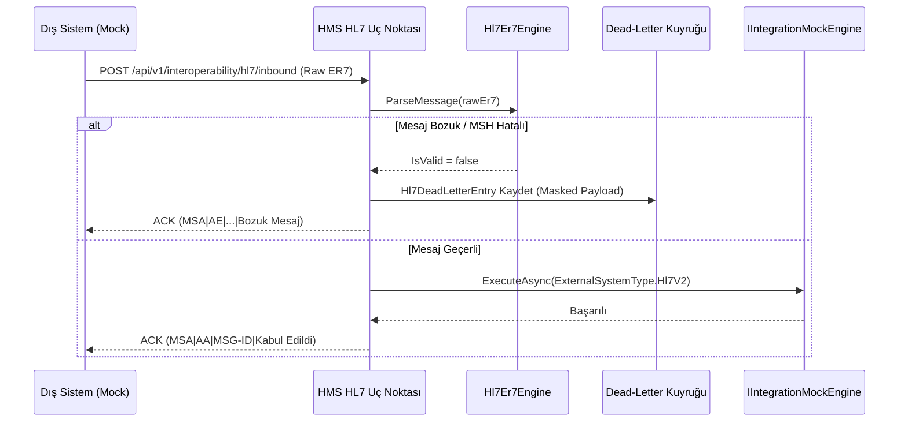

# HL7 v2 Simülasyonu ve Dead-Letter Hata Kuyruğu (HL7 v2 Simulation & Dead-Letter Queue)

## 1. Amaç ve Kapsam

Bu belge, **Faz 10 — Mock entegrasyonlar ve birlikte çalışabilirlik** kapsamında `F10-G03 — HL7 v2 simülasyonu` görevinin teknik mimarisini, ER7 boru-ayraçlı (pipe-delimited) mesaj ayrıştırıcı ve üreteç motorunu (`Hl7Er7Engine`), inbound mesaj işleme akışını, ACK (Application Accept/Error) protokolünü ve `Hl7DeadLetterQueue` mekanizmasını açıklar.

Sistem, geleneksel hastane bilgi yönetim sistemleri (HBYS), laboratuvar bilgi sistemleri (LIS) ve cihaz ara birimleriyle veri alışverişini HL7 v2.3.1 ER7 formatında simüle eder.

> [!IMPORTANT]
> **Gizlilik ve Güvenlik:** HL7 mesaj içerikleri günlüklere veya dead-letter kuyruğuna yazılırken PHI (korunan sağlık bilgisi) açık metin olarak kaydedilmez; yalnızca segment türü ve yapısal özet (`MaskPayload`) saklanır. Tüm kimlikler sentetiktir (`DEMO-*`, `MSG-*`).

---

## 2. Desteklenen HL7 v2 Mesaj Türleri

| Mesaj Türü | Tetikleyici Olay | Tanım ve İçerdiği Segmentler |
|---|---|---|
| **ADT^A01** | `A01` (Patient Admit) | Hasta yatış ve yatak tahsis bildirimi (`MSH`, `EVN`, `PID`, `PV1`) |
| **ADT^A03** | `A03` (Patient Discharge) | Hasta taburculuk bildirimi (`MSH`, `EVN`, `PID`, `PV1`) |
| **ORM^O01** | `O01` (Order Message) | Laboratuvar/radyoloji tetkik istemi iletimi (`MSH`, `PID`, `ORC`, `OBR`) |
| **ORU^R01** | `R01` (Observation Result) | İstem yanıtı ve sonuç iletimi (`MSH`, `PID`, `OBR`, `OBX`) |
| **ACK** | Genel Yanıt | Mesaj alındı/onay/hata bildirimi (`MSH`, `MSA` - `AA`, `AE`, `AR`) |

---

## 3. Inbound İşleme, Doğrulama ve Dead-Letter Kuyruğu

### 3.1 Dead-Letter Girişi (`Hl7DeadLetterEntry`)
- `MessageControlId`: Mesaj takip kimliği (`MSH-10`).
- `MessageType`: Mesaj ve tetikleyici türü (örn. `ORU^R01`).
- `FailureReason`: Ayrıştırma veya işleme hatasının teknik açıklaması.
- `PayloadSummary`: PHI içermeyen segment dağılımı (örn. `{"segmentCount": 4, "segments": ["MSH", "PID", "OBR", "OBX"]}`).
- `RetryCount`, `IsResolved`, `ResolvedAtUtc`: Kuyruktan yeniden işleme durumu.

---

## 4. API Uç Noktaları

| Metot | Yol | Açıklama |
|---|---|---|
| `POST` | `/api/v1/interoperability/hl7/inbound` | Gelen ham ER7 mesajını işler ve HL7 ACK yanıtı döner |
| `POST` | `/api/v1/interoperability/hl7/generate/{messageType}` | Sentetik HL7 v2 mesajı üretir (`ADT_A01`, `ADT_A03`, `ORM_O01`, `ORU_R01`) |
| `GET` | `/api/v1/interoperability/hl7/dead-letter` | Başarısız/bozuk mesajların dead-letter kuyruğunu listeler |
| `POST` | `/api/v1/interoperability/hl7/dead-letter/{id}/retry` | Dead-letter kuyruğundaki mesajı yeniden işleme alır |

---

## 5. Doğrulama ve Testler

- **Birim Testleri (`Hl7V2ParserAndGeneratorTests`):** MSH ayrıştırma, eksik alan denetimi, `ADT^A01`, `ADT^A03`, `ORM^O01`, `ORU^R01` ER7 segment üretim doğrulaması, ACK MSA kodları.
- **Entegrasyon Testleri (`Hl7V2IntegrationTests`):** PostgreSQL üzerinde geçerli mesaj için `AA` ACK dönüşü, bozuk mesaj için `AE` ACK ve `hl7_dead_letter_entries` kaydı, dead-letter retry akışı.
