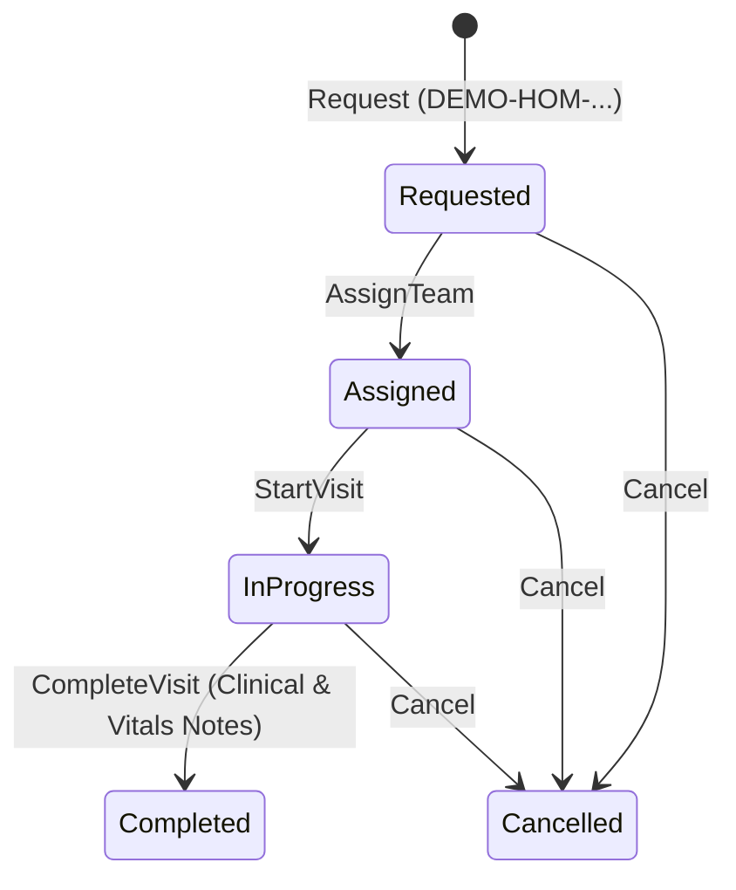

# Evde Sağlık Planlama ve Ziyaret Yönetimi (Home Health Planning and Visits)

## 1. Amaç ve Kapsam

Bu belge, **Faz 9 — Uzmanlık dikey dilimleri** kapsamında `F09-G04 — Evde sağlık planlama` görevinin teknik mimarisini, veri modelini, API sözleşmelerini ve güvenlik/gizlilik kurallarını açıklar.

Evde sağlık hizmetleri dikey dilimi; uygun hastalar için ev ziyareti talepleri oluşturma, sağlık ekibi ve personel görevlendirmesi, pansuman/kan alma/kateter/palyatif bakım takibi, ziyaret tamamlama ve klinik encounter bağlantılarını kapsar.

> [!WARNING]
> **Adres Gizliliği ve Konum Bildirimi:** Hasta açık adresi ve telefon bilgileri yalnızca ziyarete atanmış personel tarafından görüntülenir. Talep eden/sorumlu hekim dâhil diğer yetkili kullanıcıların yanıtında adres ve telefon maskelenir. Sistemde harita veya gerçek zamanlı coğrafi izleme/GPS entegrasyonu bulunmamaktadır.

---

## 2. Mimari ve Modül İzolasyonu

Modüler monolit prensiplerine uygun olarak evde sağlık dikey dilimi `SpecialtyCare` modülü altında `specialty` şemasında konumlandırılmıştır.

```
src/Modules/SpecialtyCare/
├── Domain/HomeHealth/
│   ├── HomeCareServiceType.cs
│   ├── HomeVisitPriority.cs
│   ├── HomeVisitStatus.cs
│   └── HomeHealthVisit.cs (Aggregate Root)
├── Application/
│   ├── HomeHealthDtos.cs
│   └── IHomeHealthCareService.cs
└── Infrastructure/
    ├── HomeHealthCareService.cs
    └── Persistence/
        ├── Configurations/
        │   └── HomeHealthVisitConfiguration.cs
        └── Migrations/
            └── 20260831001100_AddHomeHealthVisits.cs
```

---

## 3. Durum Yaşam Döngüsü ve Hizmet Türleri

### 3.1 Hizmet Türleri (`HomeCareServiceType`)
- `GeneralNursing` (1) - Genel Hemşirelik Muayene / Bakım
- `WoundDressing` (2) - Yara Bakımı ve Pansuman
- `BloodCollection` (3) - Evde Kan / Numune Alma
- `MedicationAdministration` (4) - İlaç Uygulama / Serum
- `PhysicalTherapyAssistance` (5) - Fizik Tedavi ve Egzersiz Desteği
- `PalliativeCare` (6) - Palyatif Bakım
- `CatheterCare` (7) - Sonda / Kateter Değişimi ve Bakımı

### 3.2 Ziyaret Yaşam Döngüsü (`HomeVisitStatus`)


---

## 4. API Uç Noktaları

| Metot | Yol | İzin | Açıklama |
|---|---|---|---|
| `POST` | `/api/v1/specialty/home-health/visits` | `specialty-care.record` | Yeni evde sağlık ziyareti talep eder |
| `GET` | `/api/v1/specialty/home-health/visits/active` | `specialty-care.view` + bakım ilişkisi/ekip | Erişilebilir aktif ziyaretleri listeler; adres yalnız atanan personele döner |
| `GET` | `/api/v1/specialty/home-health/visits/{id}` | `specialty-care.view` + bakım ilişkisi/ekip | Ziyaret ayrıntılarını getirir; adres yalnız atanan personele döner |
| `GET` | `/api/v1/specialty/home-health/visits/patient/{patientId}` | `specialty-care.view` + bakım ilişkisi/ekip | Hastaya ait erişilebilir geçmişi listeler |
| `POST` | `/api/v1/specialty/home-health/visits/{id}/assign` | `specialty-care.record` | Ziyarete personel ve planlanan tarih atar |
| `POST` | `/api/v1/specialty/home-health/visits/{id}/start` | `specialty-care.record` + atanmış personel | Ziyaret durumunu devam ediyor yapar |
| `POST` | `/api/v1/specialty/home-health/visits/{id}/complete` | `specialty-care.record` + atanmış personel | Ziyareti klinik/vital notlar ve doğrulanmış `HomeHealth` Encounter kimliğiyle tamamlar |
| `POST` | `/api/v1/specialty/home-health/visits/{id}/cancel` | `specialty-care.record` | Ziyareti iptal eder |

---

## 5. Ortak Encounter Bağı ve Veri Bütünlüğü

- Ziyaret talep, atama ve devam durumlarında `EncounterId` boş kalabilir; ziyaret tamamlanırken zorunludur ve sonradan değiştirilemez.
- Bağlanan kayıt ortak ClinicalRecords modülündeki kanonik Encounter olmalıdır. SpecialtyCare bu modülün `DbContext` veya tablolarına erişmez; `IEncounterReferenceLookup` uygulama sözleşmesini kullanır.
- Encounter aynı `PatientId` değerine sahip, `EncounterType.HomeHealth` türünde ve `InProgress`, `Completed` veya `Amended` durumunda olmalıdır. Planlanmış, iptal edilmiş, hatalı giriş, başka hasta veya başka türdeki Encounter reddedilir.
- Bir Encounter yalnız bir evde sağlık ziyaretine bağlanabilir. API ön kontrolüne ek olarak `UX_HomeHealthVisits_EncounterId` PostgreSQL benzersiz indeksi eşzamanlı yarışları engeller.
- `LinkHomeHealthVisitsToEncounters` migration'ı yeni kolon üretmez ve mevcut boş bağlantıları sahte kimlikle doldurmaz. Önceden girilmiş yinelenen, boş olmayan DEMO Encounter kimlikleri varsa migration öncesi bu sentetik kayıtlar yeniden oluşturulmalıdır.

## 6. Doğrulama ve Testler

- **Unit Testleri:** `HomeHealthDomainTests` (Talep oluşturma, protokol formatı `DEMO-HOM-...`, eksik adres/telefon, zorunlu Encounter ve durum yaşam döngüsü geçişleri).
- **Component Testleri:** `HomeHealthManagementComponentTests` (BUnit arayüz tablosu, filtre butonları, gizlilik bildirimi ve zorunlu HomeHealth Encounter alanı).
- **Entegrasyon Testleri:** `HomeHealthIntegrationTests` (PostgreSQL üzerinde Talep → Atama → yalnız atanmış hemşireyle Başlatma/Tamamlama → Hasta Geçmişi; adres maskesi; boş/bilinmeyen, başka hasta, yanlış tür/durum ve yeniden kullanılan Encounter negatifleri; benzersiz indeks yarış koruması; `403` rol testi).
