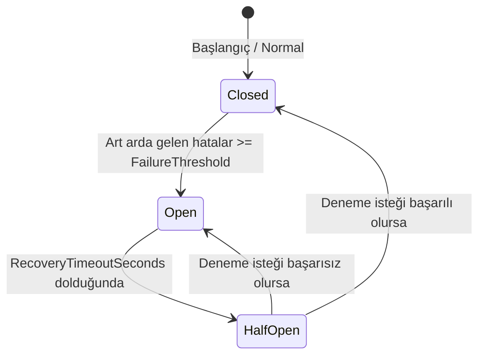

# Birlikte Çalışabilirlik Portları ve Mock Simülatör Motoru (Interoperability Ports & Mock Engine)

## 1. Amaç ve Kapsam

Bu belge, **Faz 10 — Mock entegrasyonlar ve birlikte çalışabilirlik** kapsamında `F10-G01 — Entegrasyon portları ve mock sunucu` görevinin teknik mimarisini, hata enjeksiyonu (fault injection) yeteneklerini, devre kesici (circuit breaker) politikasını ve audit/log yapısını açıklar.

Sistem, dış sağlık bilişimi standartları (FHIR R4, HL7 v2, DICOM/PACS, MHRS, e-Nabız, MEDULA/ITS/UTS, SMS/E-posta) ile doğrudan sıkı bağlılık kurmaz. Bunun yerine gevşek bağlı portlar ve yapılandırılabilir bir simülatör motoru (`IIntegrationMockEngine`) üzerinden güvenli, test edilebilir ve izlenebilir bir entegrasyon sınırı sunar.

> [!IMPORTANT]
> **Sentetik Simülasyon Güvencesi:** Modül içindeki tüm dış sistem entegrasyonları açıkça `MOCK` etiketlidir; gerçek kurum sunucularına, API anahtarlarına veya ağ soketlerine çağrı yapmaz. Tüm kimlikler ve mesajlar sentetiktir (`DEMO-*`, `CORR-*`).

---

## 2. Dış Sistem Türleri ve Hata Modları

### 2.1 Dış Sistem Türleri (`ExternalSystemType`)
- `Fhir`: HL7 FHIR R4 standardı kaynak okuma ve dışa aktarma portu
- `Hl7V2`: HL7 v2 ER7 mesajlaşma portu (ADT, ORM, ORU)
- `DicomPacs`: Radyoloji Modality Worklist (MWL) ve PACS görüntü metadata portu
- `Mhrs`: Merkezi Hekim Randevu Sistemi harici randevu senkronizasyon portu
- `ENabiz`: Ulusal sağlık kaydı gönderim kuyruğu portu
- `Medula`: SGK provizyon ve İTS/ÜTS doğrulama sınır portu (finans/provizyon demo dışıdır)
- `Notification`: SMS / E-posta yerel yakalayıcı ve bildirim portu

### 2.2 Hata Enjeksiyonu Modları (`FaultInjectionMode`)
- `None`: Normal başarılı mock yanıtı üretir.
- `Latency`: Yapılandırılan gecikme süresi kadar (`LatencyMilliseconds`) yapay bekleme uygular.
- `TransientError`: İlk çağrılarda geçici hata fırlatarak yeniden deneme (`MaxRetryAttempts`) mekanizmasını tetikler.
- `CorruptPayload`: Bozuk veya doğrulanamayan sentetik yanıt simüle eder.
- `CircuitBroken`: Devre kesiciyi zorunlu olarak tetikler.
- `Offline`: Dış servisin çevrimdışı olduğunu simüle eder.

`TimeoutSeconds` her deneme için ayrı uygulanır; yapay gecikme de bu süre bütçesine dahildir.
Çağıranın iptal belirteci ile motor timeout'u ayrıştırılır: çağıran iptali üst katmana taşınır,
motor timeout'u ise `MOCK_INTEGRATION_TIMEOUT` güvenli koduna dönüştürülür.

---

## 3. Devre Kesici (Circuit Breaker) ve Yeniden Deneme

`IntegrationCircuitState` modeli, her dış sistem için hata sayacını ve durum geçişlerini yönetir:

- **Başarısızlık Eşiği (`FailureThreshold`):** Varsayılan 5 başarısız çağrı.
- **Kurtarma Süresi (`RecoveryTimeoutSeconds`):** Varsayılan 30 saniye.
- **Yeniden Deneme (`MaxRetryAttempts`):** Üstel/kademeli bekleme ile otomatik yeniden deneme.

---

## 4. Mesaj Günlüğü ve Denetim İzi (`IntegrationMessageLog`)

Her dış sistem çağrısı için şu alanlar `interoperability.integration_message_logs` tablosunda saklanır:
- `CorrelationId`: İstek izleme kimliği (`CORR-...`).
- `SystemType`: Hedef dış sistem türü.
- `Direction`: `Inbound` (Gelen) veya `Outbound` (Giden).
- `ActionName`: Çağrılan operasyon adı.
- `PayloadSummary`: Serbest istek gövdesi yerine sabit
  `MOCK_TECHNICAL_METADATA` sınıflandırması; PHI/klinik içerik tutulmaz.
- `Status`: `Success`, `Failed`, `Retried`, `DeadLetter`.
- `RetryCount` ve `DurationMs`: Gerçekleşen deneme sayısı ve toplam süre.
- `ErrorMessage`: Yalnız allowlist güvenli MOCK hata kodu; exception mesajı tutulmaz.

`ActionName` ve dışarıdan sağlanan korelasyon kimliği yalnız ASCII harf/rakam ile `-`, `_`, `.`
karakterlerini kabul eden, 80 karakterlik teknik tanımlayıcı sınırından geçirilir.

---

## 5. API Uç Noktaları

| Metot | Yol | Açıklama |
|---|---|---|
| `GET` | `/api/v1/interoperability/mock-engine/configs` | Tüm dış sistemlerin mock yapılandırmalarını listeler |
| `PUT` | `/api/v1/interoperability/mock-engine/configs/{systemType}` | Belirli bir dış sistemin hata modunu ve gecikmesini günceller |
| `GET` | `/api/v1/interoperability/mock-engine/logs` | Entegrasyon mesaj günlüklerini listeler (sistem bazlı filtrelenebilir) |
| `POST` | `/api/v1/interoperability/mock-engine/reset-circuit/{systemType}` | Dış sistemin devre kesicisini sıfırlar (`Closed` konuma getirir) |
| `POST` | `/api/v1/interoperability/mock-engine/simulate` | Yapılandırılan ayarlarla örnek bir mock çağrı simülasyonu çalıştırır |

Tüm mock-engine uçları `interoperability.mock.manage` izniyle korunur. Varsayılan olarak bu
izin yalnız `SystemAdministrator` rolündedir; klinik roller ve hasta yapılandırma/log okuyamaz.

---

## 6. Doğrulama ve Testler

- **Birim Testleri (`MockEngineDomainTests`):** Yapılandırma alanlarının sınır kontrolü (clamping), devre kesici durum geçişleri (`Closed` -> `Open` -> `HalfOpen` -> `Closed`), korelasyon kimliği üretimi.
- **Entegrasyon Testleri (`MockServerIntegrationTests`):** PostgreSQL üzerinde mock ayarlarının güncellenmesi, yönetici dışı erişimin `403` olması, simüle edilmiş çağrının log kaydı oluşturması, `Offline` modunda güvenli ret, devre kesici sıfırlama, gerçek timeout bütçesi, transient retry, bozuk payload ve payload canary sızıntısı kontrolleri.
