# .NET MAUI Blazor Hybrid Kabuğu (Windows & Android)

Bu belge, **Faz 12 (F12-G02)** kapsamında oluşturulan `.NET MAUI Blazor Hybrid` kabuk uygulamasını, çoklu hedef platform mimarisini, DI platform servislerini ve paylaşılan host-agnostic Razor Class Library (`HospitalManagement.UI`) entegrasyonunu açıklar. İlgili mimari kararlar için [ADR-0002](../adr/ADR-0002-api-first-blazor-clients.md) ve [ADR-0004](../adr/ADR-0004-identity-and-native-oidc.md) belgelerine başvurunuz.

---

## 1. Mimari Prensipler ve Çoklu Hedef Yapısı

Proje, tek bir C#/.NET kod tabanı üzerinden hem Web (Blazor WebAssembly) hem de yerel masaüstü (Windows) ve mobil (Android) istemcileri sunmayı amaçlar.

- **Proje:** `src/HospitalManagement.Maui/HospitalManagement.Maui.csproj`
- **Hedef Platformlar (TargetFrameworks):**
  - Windows: `net10.0-windows10.0.19041.0` (WinUI 3 / Windows App SDK)
  - Android: `net10.0-android` (Android API 24+)
- **Kabuk Türü:** `.NET MAUI Blazor Hybrid` (`Microsoft.AspNetCore.Components.WebView.Maui`)
- **Tek Doğruluk Kaynağı:** Sunucu REST API'si (`/api/v1`). Yerel istemciler hiçbir zaman yerel klinik veritabanı tutmaz veya doğrudan DbContext/veritabanına erişmez.

---

## 2. Host-Agnostic UI ve RCL Katmanı (`HospitalManagement.UI`)

Tüm kullanıcı arayüzü durum panelleri, göstergeler, formlar ve ortak bileşenler `src/HospitalManagement.UI` Razor Class Library (RCL) içinde tutulur. Bu kütüphane:
- Web veya MAUI platform bağımlılığı taşımaz (`Microsoft.AspNetCore.Components.Web` tabanlıdır).
- Yalnızca `HospitalManagement.Contracts` projesine bağımlıdır.
- Platform yeteneklerine ihtiyaç duyduğunda somut sınıflara değil, DI üzerinden sağlanan platform soyutlamalarına erişir.

---

## 3. Platform Servisleri ve Bağımlılık Enjeksiyonu (DI)

Platforma özgü farklılıklar `HospitalManagement.UI.Services` ad alanı altındaki açık arayüzlerle soyutlanmıştır:

```mermaid
classDiagram
    class IPlatformInfoService {
        <<interface>>
        +string PlatformName
        +bool IsNative
        +string DeviceIdiom
        +string ApplicationVersion
    }
    class IPlatformConnectivityService {
        <<interface>>
        +bool IsConnected
        +event ConnectivityChanged
        +CheckConnectivityAsync() Task~bool~
    }
    class IAppSecureStorage {
        <<interface>>
        +SetAsync(key, value) Task
        +GetAsync(key) Task~string~
        +RemoveAsync(key) Task
        +ClearAsync() Task
    }
    class IPlatformNotificationService {
        <<interface>>
        +ShowInAppNotificationAsync(title, message, severity) Task
    }
    class IPlatformBrowserService {
        <<interface>>
        +OpenSystemBrowserAsync(uri) Task
    }

    IPlatformInfoService <|.. WebPlatformInfoService
    IPlatformInfoService <|.. MauiPlatformInfoService

    IPlatformConnectivityService <|.. WebPlatformConnectivityService
    IPlatformConnectivityService <|.. MauiPlatformConnectivityService

    IAppSecureStorage <|.. WebPlatformSecureStorage
    IAppSecureStorage <|.. MauiPlatformSecureStorage

    IPlatformNotificationService <|.. WebPlatformNotificationService
    IPlatformNotificationService <|.. MauiPlatformNotificationService

    IPlatformBrowserService <|.. WebPlatformBrowserService
    IPlatformBrowserService <|.. MauiPlatformBrowserService
```



### Servis Karşılaştırması

| Servis Arayüzü | Web İstemcisi (`Web.Client`) | MAUI İstemcisi (`HospitalManagement.Maui`) |
| :--- | :--- | :--- |
| **`IPlatformInfoService`** | `PlatformName = "Web"`, `IsNative = false`, `DeviceIdiom = "Browser"` | `PlatformName = "Windows" / "Android"`, `IsNative = true`, `DeviceIdiom = "Desktop" / "Mobile"` |
| **`IPlatformConnectivityService`** | Tarayıcı çalışma zamanı varsayımı (çevrimiçi) | `Microsoft.Maui.Networking.Connectivity` ile anlık ağ durumu ve event takibi |
| **`IAppSecureStorage`** | Bellek içi geçici sözlük (ADR-0004 gereği diskte/localStorage'da token tutulmaz) | Windows DPAPI / Android Keystore donanım destekli şifreli saklama (`SecureStorage.Default`) |
| **`IPlatformNotificationService`** | Uygulama içi bildirim / banner | Güvenli uygulama içi bildirim (PHI lock screen'e sızdırılmaz) |
| **`IPlatformBrowserService`** | `NavigationManager` | `Launcher.Default.OpenAsync` ile sistem varsayılan tarayıcısı |

---

## 4. Derleme ve Doğrulama Komutları

```powershell
# Windows hedefini derleme
dotnet build src/HospitalManagement.Maui/HospitalManagement.Maui.csproj -f net10.0-windows10.0.19041.0 -r win-x64

# Android hedefini derleme
dotnet build src/HospitalManagement.Maui/HospitalManagement.Maui.csproj -f net10.0-android

# Mimari bağımlılık ve proje referans kurallarını doğrulama
dotnet test tests/HospitalManagement.ArchitectureTests/HospitalManagement.ArchitectureTests.csproj -c Release --no-restore

# Bileşen ve platform servisleri testlerini çalıştırma
dotnet test tests/HospitalManagement.ComponentTests/HospitalManagement.ComponentTests.csproj -c Release --no-restore --filter "PlatformServicesTests"
```
