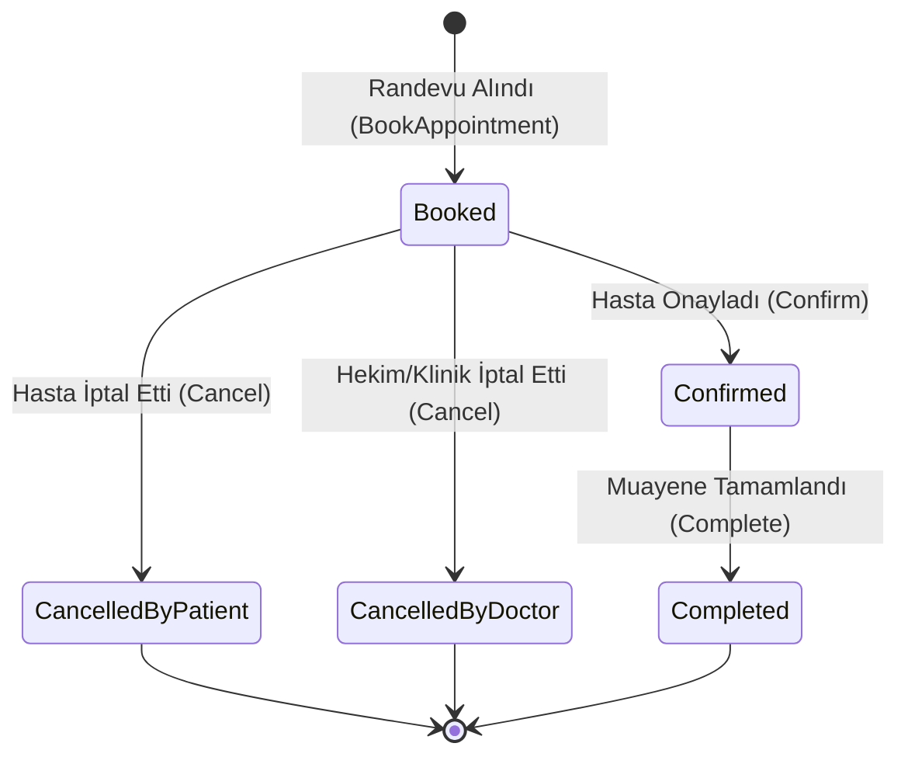

# MHRS Randevu Sistemi Mock Entegrasyonu (MHRS Mock Integration)

## 1. Amaç ve Kapsam

Bu belge, **Faz 10 — Mock entegrasyonlar ve birlikte çalışabilirlik** kapsamında `F10-G05 — MHRS mock` görevinin teknik mimarisini, Merkezi Hekim Randevu Sistemi (MHRS) randevu alma/güncelleme/iptal simülasyonunu, slot sorgulama mantığını, idempotency mekanizmasını ve çift-randevu (slot conflict) çözümünü açıklar.

Sistem, Sağlık Bakanlığı MHRS randevu servisleriyle entegrasyonu tamamen sentetik veriler ve yerel mock portu (`IIntegrationMockEngine`) üzerinden simüle eder.

> [!IMPORTANT]
> **Mock Entegrasyon ve Sentetik Kimlik Güvencesi:** Tüm TC Kimlik Numaraları sentetiktir (`11111111110`, `22222222220` vb.), randevu slotları yerel veritabanında tutulur (`mhrs_appointments`). Canlı MHRS sunucularına veya Bakanlık API'lerine hiçbir gerçek ağ çağrısı yapılmaz.

---

## 2. MHRS Veri Modelleri ve Randevu Yaşam Döngüsü

### 2.1 Desteklenen Randevu Durumları (`MhrsAppointmentStatus`)
- `Booked`: MHRS üzerinden randevu oluşturuldu.
- `Confirmed`: Hasta randevuyu teyit etti.
- `CancelledByPatient`: Hasta tarafından iptal edildi.
- `CancelledByDoctor`: Hekim veya poliklinik tarafından iptal edildi.
- `Completed`: Randevu muayenesi gerçekleşti.

---

## 3. Idempotency ve Slot Çatışma Çözümü

1. **Idempotency Güvencesi (`IdempotencyKey`):**
   - Ağ kesintisi veya mükerrer form gönderimlerinde aynı `IdempotencyKey` ile gelen istekler veritabanında mükerrer kayıt oluşturmaz; mevcut randevu kaydı güvenli şekilde döndürülür.
2. **Slot Çakışma Denetimi (`SlotId Conflict`):**
   - Aynı hekim ve saat dilimine ait bir `SlotId` zaten aktif (`Booked`/`Confirmed`) bir randevu içeriyorsa, farklı bir kullanıcıdan gelen talep `400 BadRequest` / `Geçersiz İşlem` hatası ile reddedilir.
3. **İki Yönlü Senkronizasyon (`SyncWithLocalSchedule`):**
   - Yerel randevu takvimi ile MHRS randevuları arasında tarih bazlı mutabakat özeti üretilir.

---

## 4. API Uç Noktaları

| Metot | Yol | Açıklama |
|---|---|---|
| `GET` | `/api/v1/interoperability/mhrs/slots` | Hekim, poliklinik ve tarihe göre uygun MHRS randevu slotlarını listeler |
| `POST` | `/api/v1/interoperability/mhrs/appointments` | Yeni bir MHRS randevusu oluşturur (idempotency anahtarı ile) |
| `POST` | `/api/v1/interoperability/mhrs/appointments/{mhrsAppointmentId}/cancel` | Mevcut bir MHRS randevusunu iptal eder |
| `GET` | `/api/v1/interoperability/mhrs/patients/{patientNationalId}/appointments` | Hastaya ait tüm MHRS randevularını listeler |
| `POST` | `/api/v1/interoperability/mhrs/sync` | Yerel randevu takvimi ile MHRS randevularını senkronize eder |

---

## 5. Doğrulama ve Testler

- **Birim Testleri (`MhrsDomainTests`):** Randevu kaydı başlatma, durum geçişleri (`Confirm`, `Cancel`, `Complete`), slot parametre denetimi.
- **Entegrasyon Testleri (`MhrsIntegrationTests`):** PostgreSQL üzerinde slot sorgulama, idempotency anahtarı ile tekrar denemede aynı randevunun dönmesi, çakışan slot talebinin reddedilmesi, randevu iptali ve senkronizasyon özeti.
