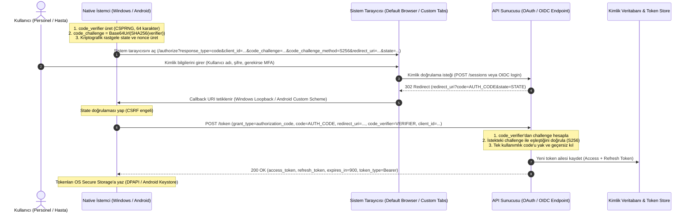
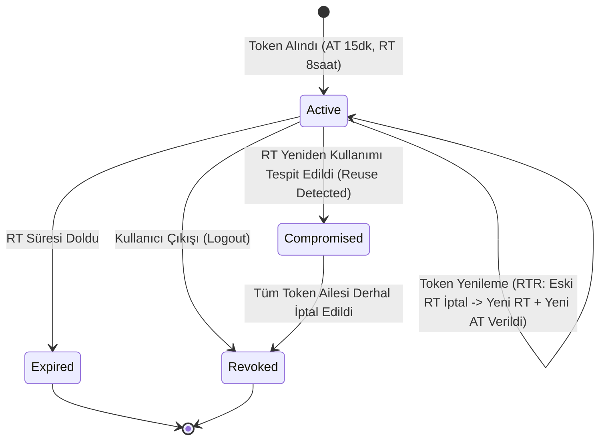

# Native Kimlik ve Güvenlik Tasarımı (Windows & Android)

Bu belge, **Faz 12 (F12-G01)** kapsamında Windows ve Android native istemcileri için belirlenen OAuth 2.0, OpenID Connect (OIDC) ve PKCE kimlik güvenliği mimarisini ve teknik uygulama detaylarını açıklar. İlgili mimari karar için [ADR-0004](../adr/ADR-0004-identity-and-native-oidc.md) belgesine başvurunuz.

---

## 1. Mimari Prensipler ve Standartlar

1. **RFC 6749 & RFC 6750:** OAuth 2.0 Yetkilendirme Çerçevesi ve Bearer Token Kullanımı.
2. **RFC 7636:** Proof Key for Code Exchange (PKCE) - Public Client saldırılarına karşı yetkilendirme kodu koruması.
3. **RFC 8252:** OAuth 2.0 for Native Apps (BCP 212) - Sistem tarayıcısı zorunluluğu, gömülü webview yasağı, loopback ve özel şema kuralları.
4. **RFC 7009:** OAuth 2.0 Token Revocation - Güvenli oturum kapatma ve token iptali.
5. **Homemade JWT Yasağı:** Projede standart dışı, kendi kendine token üreten veya doğrulayan kriptografik zayıf kodlar yazılmaz; yerleşik ve standart .NET güvenlik kütüphaneleri kullanılır.
6. **Web Cookie Akışı İzolasyonu:** Web istemcisinin (Blazor WASM) kullandığı `__Host-HospitalManagement.Auth` SameSite=Strict cookie ve antiforgery koruması korunur; native istemciler web oturumunu bozmaz veya taklit etmez.

---

## 2. Yetkilendirme Akışı (PKCE + Sistem Tarayıcısı)

Native istemciler istemci gizli anahtarı (`client_secret`) saklayamayacağından (Public Client), yetkilendirme kodu yakalama saldırılarına (Authorization Code Interception Attack) karşı PKCE S256 zorunludur.

---

## 3. Callback URI Kuralları ve Doğrulama (`NativeCallbackUriValidator`)

RFC 8252 gereği yetkilendirme kodunun güvenle native uygulamaya dönebilmesi için aşağıdaki kurallar zorunludur:

| Platform | Desteklenen Callback Deseni | Örnek URI | Güvenlik Koruması |
| :--- | :--- | :--- | :--- |
| **Windows Desktop** | Loopback IP (Tercih edilen) | `http://127.0.0.1:{port}/callback` veya `http://localhost:{port}/callback` | Rastgele boş port dinleme, loopback IP dışı dinleyiciye izin vermeme, host header doğrulama. |
| **Windows Desktop** | Özel URI Şeması (Fallback) | `hospitalmanagement://auth-callback` | Windows Protocol Handler kaydı. |
| **Android Mobil** | Özel URI Şeması | `hospitalmanagement://auth-callback` | Android Intent Filter ve package doğrulaması. |
| **Android Mobil** | Android App Links | `https://hospital.example.com/auth-callback` | Dijital varlık bağlantıları (`assetlinks.json`) ile domain sahiplik doğrulaması. |

### Açık Yönlendirme (Open Redirect) Engelleme
- Geçersiz host veya yabancı IP içeren yönlendirmeler atomik olarak reddedilir.
- Göreli şemalar (`//attacker.com`), `javascript:`, `data:` ve kullanıcı kimlik bilgisi (`user:pass@`) içeren URI'lar `NativeCallbackUriValidator` tarafından engellenir.

---

## 4. Token Yaşam Döngüsü ve Refresh Token Rotasyonu (RTR)

1. **Kısa Ömürlü Access Token:** Access token'lar 15 dakika geçerlidir. Hırsızlık durumunda etki alanı daraltılır.
2. **Refresh Token Rotasyonu:** Her `POST /token?grant_type=refresh_token` çağrısında mevcut refresh token derhal geçersiz kılınır ve yeni bir refresh token üretilir.
3. **Yeniden Kullanım Tespiti (Reuse Detection):** Eğer bir refresh token ikinci kez kullanılmaya çalışılırsa (saldırganın ve meşru kullanıcının aynı token'ı kullanması senaryosu), sunucu bunu bir sızıntı göstergesi olarak kabul eder. İlgili kullanıcı oturumuna ait **tüm token ailesi (token family) iptal edilir** ve meşru kullanıcı derhal yeniden giriş yapmaya yönlendirilir.
4. **Token Revocation (RFC 7009):** `POST /api/v1/identity/native/logout` veya token revocation uç noktası çağrıldığında sunucu tarafında aktif oturum sonlandırılır.

---

## 5. Platform Güvenli Depolama (Secure Storage) Karşılaştırması

| Özellik | Windows Masaüstü | Android Mobil |
| :--- | :--- | :--- |
| **Mekanizma** | Windows Data Protection API (DPAPI) / Windows Credential Manager | Android Keystore + `EncryptedSharedPreferences` / MAUI `ISecureStorage` |
| **Şifreleme Türü** | Kullanıcı oturum anahtarına bağlı simetrik şifreleme (`DataProtectionScope.CurrentUser`) | Donanım destekli (TEE/StrongBox) AES-256 GCM anahtarı |
| **Düz Metin Riski** | Yok (Registry veya dosyaya asla düz metin yazılmaz) | Yok (Uygulama sandbox'ında şifrelenmiş saklanır) |
| **Cihaz Yedekleme Riski** | DPAPI anahtarı başka makineye aktarılamaz | `android:allowBackup="false"` ve Keystore anahtarları yedeklenemez |
| **Çevrimdışı Klinik Veri** | **Kesinlikle saklanmaz** (yalnızca auth token tutulur) | **Kesinlikle saklanmaz** (yalnızca auth token tutulur) |

---

## 6. Tehdit Modeli ve Kontrol Eşlemesi

| Tehdit ID | Tehdit Tanımı | Kontrol Mekanizması | Doğrulama Yöntemi |
| :--- | :--- | :--- | :--- |
| **TM-02** | Session fixation / Çalıntı token | Kısa ömürlü token (15 dk), Refresh Token Rotation, güvenli storage | Oturum rotasyon ve iptal testleri |
| **TM-22** | Cihazda güvensiz token saklama | Windows DPAPI, Android Keystore, klinik veri offline cache yasağı | Unit testler ve platform smoke kontrolleri |
| **TM-26** | Yetkilendirme kodu yakalama (Code Interception) | PKCE S256 zorunluluğu (`code_challenge_method=S256`), loopback IP | PKCE doğrulama ve sahte verifier testleri |
| **TM-27** | Çalınan refresh token istismarı | RTR ve Reuse Detection ile tüm aileyi iptal etme | Mükerrer refresh token deneme testleri |
| **TM-28** | Open Redirect / Callback hijacking | `NativeCallbackUriValidator` allow-list ve şema denetimi | Open redirect ve bozuk URI negatif testleri |

---

## 7. Web Cookie ve Native İstemci Bir Arada Yaşama Stratejisi

ASP.NET Core Host API, iki farklı kimlik doğrulama şemasını uyum içinde destekler:
1. **Web İstekleri:** `CookieAuthenticationDefaults.AuthenticationScheme` (`__Host-HospitalManagement.Auth`), Antiforgery Header (`X-XSRF-TOKEN`).
2. **Native İstekleri:** `JwtBearerDefaults.AuthenticationScheme` veya Bearer token middleware (`Authorization: Bearer <access_token>`).
3. **Prensip:** Web istekleri asla native token sızdırmaz; native istemciler asla cookie gerektirmez. API yetkilendirme politikaları (`Permission`, `ResourceScope`) istemci türünden bağımsız olarak aynı claims matrisini çalıştırır.
