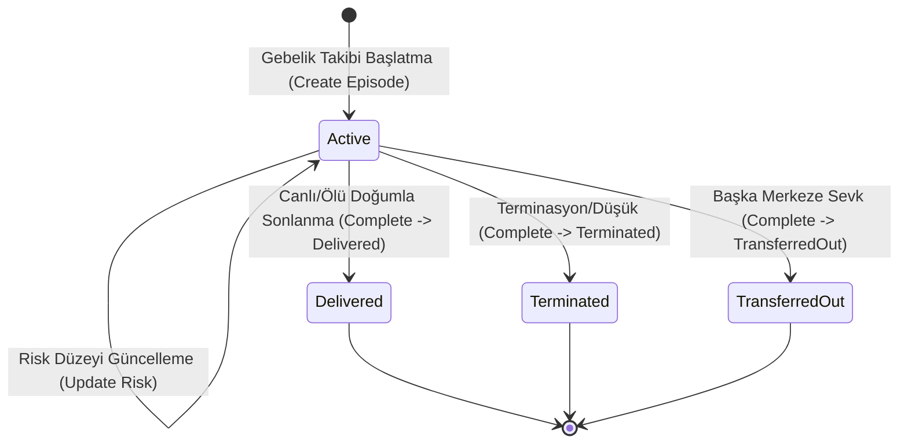

# Kadın Doğum ve Gebelik Takibi (Obstetrics & Antenatal Care)

Bu doküman, Faz 9 uzmanlık dikey süreçleri kapsamında kadın doğum ve gebelik takibi (antenatal izlem), obstetrik öykü (G/P/A/L), Naegele tahmini doğum tarihi (EDD) hesaplaması, risk katmanlandırması ve antenatal vizit yaşam döngüsünü açıklar.

## 1. Amaç ve Klinik Simülasyon Bildirimi

- **Modül:** `HospitalManagement.Modules.SpecialtyCare` (Şema: `specialty`)
- **Simülasyon Kapsamı:** Bu sistem eğitim ve yönetim simülasyonu amaçlıdır; sertifikalı HBYS veya bağımsız klinik karar destek sistemi niteliği taşımaz. Tıbbi kararlar yetkili sağlık profesyonelinin klinik değerlendirmesine dayanır.
- **Klinik Süreklilik:** Gebelik süreci (`PregnancyEpisode`) tek bir aktif kayıt olarak yönetilir; her vizitte fizyolojik parametreler (`AntenatalVisit`) kaydedilir ve risk seviyesi dinamik olarak güncellenir.
- **Kanonik Bağ:** Yeni gebelik takibi `OpeningEncounterId`, her antenatal vizit ise `EncounterId` taşır. Bu kimlikler ClinicalRecords modülünün açık uygulama sözleşmesiyle doğrulanır; SpecialtyCare başka modülün `DbContext` veya tablosuna erişmez.
- **Randevu Zinciri:** Referans verilen encounter aynı anne hastaya ait, iptal/hatalı giriş durumunda olmayan ve kanonik `AppointmentId` taşıyan bir kayıt olmalıdır. Appointment kimliği SpecialtyCare içinde kopyalanmaz; `PregnancyEpisode/AntenatalVisit -> Encounter -> Appointment` zinciri üzerinden izlenir.

## 2. Obstetrik Temel Model ve Hesaplama Kuralları

### Obstetrik Öykü (Gravida / Para / Abortus / Living)
- **Gravida (G):** Toplam gebelik sayısı (mevcut gebelik dahil $\ge 1$).
- **Para (P):** 20. gebelik haftasından sonra gerçekleşen canlı veya ölü doğum sayısı ($\ge 0$).
- **Abortus (A):** 20. gebelik haftasından önceki düşük sayısı ($\ge 0$).
- **Living (L):** Yaşayan çocuk sayısı ($\ge 0$).

### Naegele Tahmini Doğum Tarihi (EDD)
- Son adet tarihi (LMP) üzerinden standart Naegele kuralı ile 40 hafta (280 gün) eklenerek tahmini doğum tarihi hesaplanır:
  $$\text{EDD} = \text{LMP} + 280\text{ gün}$$
- Ultrason veya hekim düzeltmesi varsa özel tahmini doğum tarihi (`customEstimatedDeliveryDateUtc`) girilebilir.

### Risk Sınıflandırması (`PregnancyRiskCategory`)
- `LowRisk`: Standart antenatal izlem protokolü.
- `HighRisk`: Genel yüksek risk.
- `GestationalDiabetes`: Gestasyonel diyabet riski/takibi.
- `Preeclampsia`: Preeklampsi veya hipertansiyon takibi.
- `MultipleGestation`: Çoğul gebelik.
- `OtherHighRisk`: Diğer spesifik maternal/fetal risk faktörleri.

## 3. Yaşam Döngüsü ve Statü Makinesi

- **Mükerrer Takip Engeli:** Aynı hasta için aynı anda iki aktif gebelik takibi açılamaz (`409 Conflict`).
- **Aktif Olmayan Takip Koruması:** `Delivered`, `Terminated` veya `TransferredOut` durumundaki takiplere yeni vizit veya risk güncellemesi yapılamaz (`409 Conflict`).
- **Referans Koruması:** Boş, bulunamayan, başka hastaya ait, randevusuz, iptal edilmiş veya hatalı giriş encounter referansı `400 Validation Problem` ile reddedilir. Yanıt, başka hastaya ait kaydın varlığını açıklamaz.

## 4. Yetkilendirme ve Denetim İzi (Audit)

- **Yetkilendirme:**
  - `specialty-care.manage`: Hekim ve başhekim (`Doctor`, `ChiefMedicalOfficer`).
  - `specialty-care.record`: Hekim, Ebe, Hemşire, Başhekim (`Doctor`, `Nurse`, `ChiefMedicalOfficer`).
  - `specialty-care.view`: Hekim, hemşire ve başhekim (`Doctor`, `Nurse`, `ChiefMedicalOfficer`).
  - Her API çağrısında izne ek olarak gerçek `Patient` kaydı ile aktif bakım ilişkisi veya kayıt üzerindeki ekip ataması doğrulanır.
  - `SystemAdministrator` doğrudan klinik kayıt giremez (`403 Forbidden`).
- **Audit Olayları:**
  - `Specialty.PregnancyEpisodeCreate`
  - `Specialty.AntenatalVisitRecord`
  - `Specialty.PregnancyEpisodeUpdate`
  - `Specialty.PregnancyEpisodeComplete`

## 5. API Uç Noktaları

| Metot | Yol | İzin | Açıklama |
| :--- | :--- | :--- | :--- |
| `POST` | `/api/v1/specialty/pregnancy-episodes` | `specialty-care.record` | Yeni gebelik takip süreci başlatır |
| `GET` | `/api/v1/specialty/pregnancy-episodes/active` | `specialty-care.view` | Aktif gebelik takiplerini listeler |
| `GET` | `/api/v1/specialty/pregnancy-episodes/{id}` | `specialty-care.view` | Belirtilen gebelik takibinin detaylarını getirir |
| `GET` | `/api/v1/specialty/pregnancy-episodes/patient/{patientId}` | `specialty-care.view` | Hastanın tüm gebelik takiplerini listeler |
| `POST` | `/api/v1/specialty/pregnancy-episodes/{id}/antenatal-visits` | `specialty-care.record` | Antenatal vizit bulgularını kaydeder |
| `POST` | `/api/v1/specialty/pregnancy-episodes/{id}/risk-category` | `specialty-care.record` | Risk seviyesini ve notlarını günceller |
| `POST` | `/api/v1/specialty/pregnancy-episodes/{id}/complete` | `specialty-care.record` | Gebelik takibini sonlandırır |

## 6. Doğrulama ve Testler

- **Birim Testleri:** `PregnancyTrackingDomainTests` (EDD hesaplaması, fizyolojik vizit sınırları, risk geçişleri).
- **BUnit Bileşen Testleri:** `PregnancyTrackingComponentTests` (aktif takipler, vizit kartları, simülasyon banner'ı, aksiyon butonları).
- **PostgreSQL Testcontainers Entegrasyon Testleri:** `PregnancyTrackingIntegrationTests` (randevuya bağlı kanonik encounter, tam yaşam döngüsü, eksik bağlantı doğrulaması, mükerrer aktif takip engeli, yetki matrisi).
- **Veritabanı yarış koruması:** Aynı hasta için ikinci aktif gebelik, kısmi benzersiz indeks ile veritabanında da engellenir.
- **Migration rollout notu:** `LinkPregnancyToEncounters` bağlantı kolonlarını zorunlu ekler. Geçmiş DEMO gebelik verileri güvenilir biçimde otomatik eşlenemeyeceğinden migration sahte `Guid.Empty` üretmez; eski yerel DEMO satırları bulunan veritabanında önce yalnız sentetik veriyi kontrollü biçimde yeniden oluşturun.
