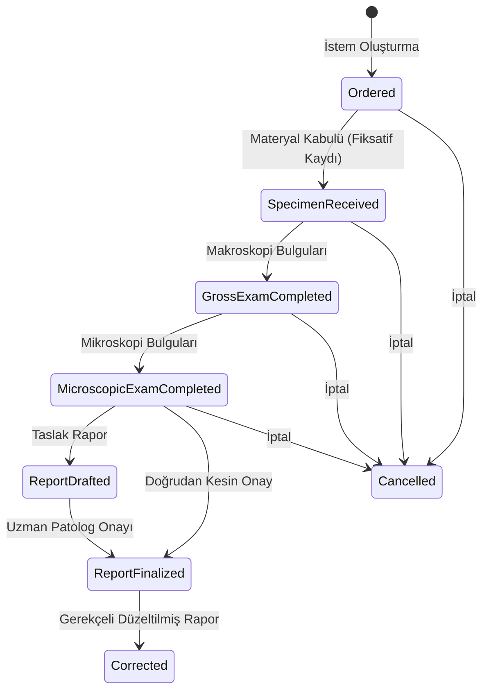

# Patoloji Dikey Dilimi (F06-G08)

Bu doküman, Tanısal Hizmetler modülü altındaki **Patoloji Dikey Dilimi (F06-G08)** bileşeninin mimarisini, veri modelini, yaşam döngüsü durum makinesini, klinik değişmezlik ve gerekçeli rapor düzeltme kurallarını açıklar.

## 1. Mimari ve Amaç

Patoloji dikey dilimi, hastanede doku ve sitoloji materyallerinin laboratuvara kabulünden makroskopi, mikroskopi incelemelerine, uzman patolog tarafından onaylanan raporlama sürecine ve zorunlu gerekçeli düzeltme akışına kadar olan tüm adımları yönetir.

- Gerçek hasta verisi veya dış entegrasyon içermez; tamamen sentetik `DEMO` verileriyle çalışır.
- Numune zincirinin ve raporlama aşamalarının bütünlüğü denetim izi (audit log) ile garanti altına alınır.

---

## 2. Durum Makinesi (State Machine)

Patoloji vaka kaydı (`PathologyCase`) aşağıdaki doğrusal ve korumalı durum geçişlerini takip eder:

---

## 3. Klinik Değişmezlik ve Rapor Düzeltme (Correction)

1. **Kesinleşmiş Rapor Değişmezliği**: Durumu `ReportFinalized` veya `Corrected` olan bir patoloji raporu doğrudan güncellenemez veya sessizce değiştirilemez.
2. **Gerekçeli Düzeltme Zinciri**: Bir patoloji raporu üzerinde revizyon yapılması gerektiğinde `CorrectPathologyReport` komutu ile zorunlu düzeltme gerekçesi (`CorrectionReason`) ve yeni tanı girilir; orijinal rapora referans veren (`PreviousCaseId`) ve `-CORR` ekli yeni bir vaka sürümü oluşturulur.
3. **Hasta IDOR Güvenliği**: Hastalar yalnızca kendi adlarına ait ve durumu `ReportFinalized` veya `Corrected` olan patoloji raporlarını görüntüleyebilir; taslak veya inceleme aşamasındaki kayıtlara erişemez.
4. **Denetim İzi (Audit)**: Tüm vaka oluşturma, kabul, makroskopi/mikroskopi kayıt, kesinleştirme ve düzeltme işlemleri `Diagnostics.PathologyCaseCreate`, `Diagnostics.PathologySpecimenReceive`, `Diagnostics.PathologyGrossExamRecord`, `Diagnostics.PathologyMicroscopicExamRecord`, `Diagnostics.PathologyReportFinalize` ve `Diagnostics.PathologyReportCorrect` olarak audit günlüğüne kaydedilir.
