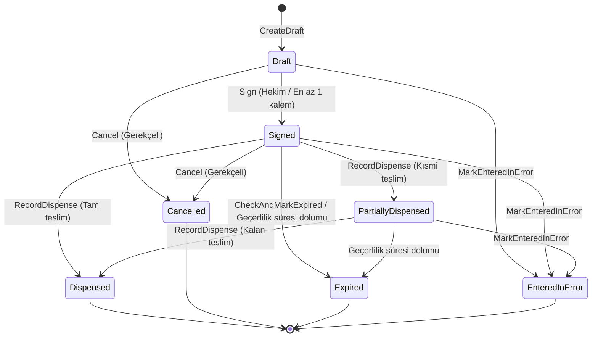

# Reçete Modeli ve Yaşam Döngüsü Durum Makinesi (Prescription Model & Lifecycle - F05-G02)

Bu belge, **Faz 5: Reçete, Eczane ve Klinik Stok** aşamasının `F05-G02 — Reçete modeli` görevi kapsamında geliştirilen reçete veri yapısını, reçete kalemlerini, durum makinesi geçişlerini, klinik değişmezlik kurallarını ve denetim izi mekanizmalarını açıklar.

---

## 1. Mimari Genel Bakış

- **Modül:** `HospitalManagement.Modules.Pharmacy`
- **Şema:** `pharmacy`
- **Tablolar:**
  - `prescriptions` (Ana reçete tablosu)
  - `prescription_items` (Reçete kalemleri tablosu)
- **Varlıklar:**
  - `Prescription` (Reçete kök varlığı)
  - `PrescriptionItem` (Reçete kalemi varlığı)
- **Durum Makinesi Enum'ı:**
  - `PrescriptionStatus`: `Draft` (1), `Signed` (2), `PartiallyDispensed` (3), `Dispensed` (4), `Cancelled` (5), `Expired` (6), `EnteredInError` (7).
- **Servis Arayüzü & Uygulaması:**
  - `IPrescriptionService` & `PrescriptionService`
- **REST Uç Noktaları:**
  - `POST /api/v1/pharmacy/prescriptions` (Taslak oluşturma)
  - `GET /api/v1/pharmacy/prescriptions/{id:guid}` (Detay sorgulama)
  - `GET /api/v1/pharmacy/prescriptions/by-encounter/{encounterId:guid}` (Karşılaşma reçeteleri)
  - `GET /api/v1/pharmacy/prescriptions/by-patient/{patientId:guid}` (Hasta reçete listesi)
  - `PUT /api/v1/pharmacy/prescriptions/{id:guid}` (Taslak güncelleme)
  - `POST /api/v1/pharmacy/prescriptions/{id:guid}/sign` (Dijital imzalama)
  - `POST /api/v1/pharmacy/prescriptions/{id:guid}/cancel` (Gerekçeli iptal)
  - `POST /api/v1/pharmacy/prescriptions/{id:guid}/entered-in-error` (Hatalı giriş kaydı)

---

## 2. Durum Makinesi ve Geçiş Kuralları

### Değişmez Klinik Kurallar (Invariants):
1. **İmzalı Reçete Değişmezliği (Immutability):**
   - İmzalanmış (`Signed`) bir reçete sessizce veya doğrudan `PUT` ile güncellenemez (`409 Conflict`).
   - Değişiklik gerekiyorsa hekim reçeteyi gerekçeli olarak iptal eder (`Cancelled`) veya hatalı giriş kaydı (`EnteredInError`) açar ve yeni bir reçete düzenler.
2. **Kalem Zorunluluğu:**
   - Kalemsiz reçete taslağı oluşturulabilir fakat imzalanamaz (`Sign` işlemi boş reçetede hata verir).
3. **Geçerlilik Süresi Sınırı:**
   - İmzalanan reçeteler varsayılan olarak 14 gün (1-90 gün aralığında parametrik) geçerlilik süresine (`ValidUntilUtc`) sahiptir.
   - Süresi dolan reçeteler `Expired` durumuna geçer ve ilaç teslimi yapılamaz.
4. **Miktar Aşımı Koruması:**
   - Eczane tesliminde teslim edilen miktar (`DispensedQuantity`), reçete edilen toplam miktarı (`Quantity`) aşamaz.

---

## 3. Yetkilendirme ve IDOR Koruması

- `prescription.create`: Hekim, Başhekim.
- `prescription.sign`: Hekim, Başhekim.
- `prescription.cancel`: Hekim, Başhekim.
- `prescription.dispense`: Eczacı.
- `prescription.view`: Hekim, Hemşire, Başhekim, Eczacı, Hasta (kendi reçeteleri).
- **Hasta Portalı İzolasyonu:**
  - Hasta yalnızca kendi reçetelerini görebilir (`PatientId == actor.PersonId`).
  - Taslak (`Draft`) veya hatalı giriş (`EnteredInError`) durumundaki kayıtlar hasta ekranında gizlenir.
- **Klinisyen kaynak kapsamı:** Oluşturma, görüntüleme, güncelleme ve imzalama işlemlerinde kesin izinle birlikte gerçek encounter, hasta/bölüm eşleşmesi ve bakım ilişkisi doğrulanır. İstek içindeki hekim kimliği güven kaynağı değildir; oturumdaki person kimliği kullanılır.
- **Eczacı kapsamı:** Eczacı yalnız geçerli eczane durumlarını ve tesis kapsamındaki minimum reçete verisini görür; tanı, encounter, bölüm/hekim kimlikleri ve düzeltme gerekçeleri redakte edilir.
- **İyimser eşzamanlılık:** Güncelleme, imza, iptal, hatalı giriş ve teslim istekleri `ExpectedVersion` taşır; bayat istemci yazmaları `409 Conflict` ile reddedilir.

---

## 4. Denetim İzi (Audit Trail)

Tüm reçete işlemleri `audit_privacy.audit_logs` tablosuna append-only olarak kaydedilir:
- `Pharmacy.PrescriptionCreateDraft`
- `Pharmacy.PrescriptionUpdateDraft`
- `Pharmacy.PrescriptionSign`
- `Pharmacy.PrescriptionCancel`
- `Pharmacy.PrescriptionEnteredInError`
- `Pharmacy.PrescriptionDispense`
- `Pharmacy.PrescriptionView`

---

## 5. Doğrulama ve Test Kapsamı

- **Birim Testleri:** `PrescriptionDomainTests.cs` — Taslak oluşturma, kalem ekleme/çıkarma, imzalama ve versiyon artışı, boş reçete engeli, imzalı reçeteyi değiştirme engeli, kısmi/tam teslim, miktar aşımı, süre dolumu ve terminal durum değişmezliği.
- **Entegrasyon Testleri:** `PrescriptionLifecycleIntegrationTests.cs` (2 test) — Gerçek PostgreSQL üzerinde uçtan uca reçete taslağı -> imzalama -> eczacı sorgusu -> hasta portalı sorgusu -> hekim iptali -> denetim logu doğrulaması, 401 yetkisiz ve 403 hasta IDOR engelleri.
- Güncel faz kapısı test sayıları `docs/development/phase5-mvp-product-gate-validation.md` belgesinde tutulur.
