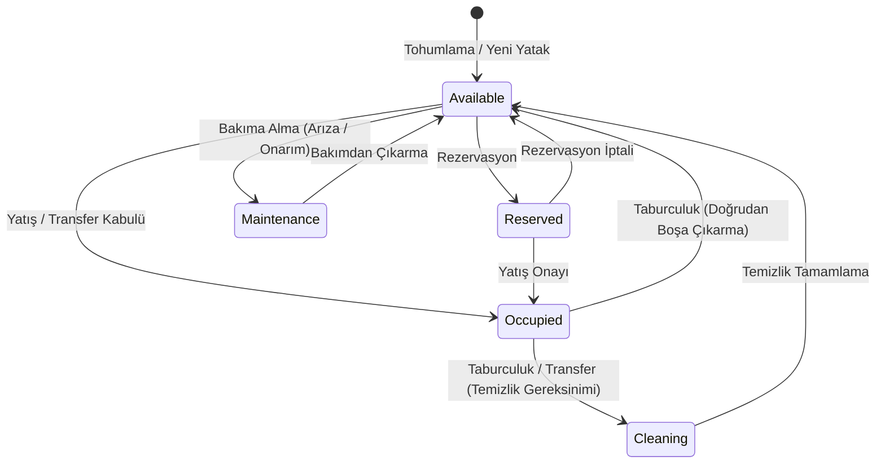

# Servis, Oda ve Yatak Modeli (F07-G01)

Bu doküman, Yatan Hasta ve Klinik İş Akışları modülü altındaki **Servis, Oda ve Yatak Modeli (F07-G01)** bileşeninin mimarisini, veri modelini, yatak durum geçiş kurallarını ve denetim izi mekanizmalarını açıklar.

## 1. Mimari ve Amaç

Yatan hasta modülü (`inpatient` şeması), hastanenin servis (ward), oda (room) ve yatak (bed) hiyerarşisini, oda ve yatak kısıtlarını (cinsiyet uygunluğu, negatif basınç, temas/damlacık izolasyonu, telemetri, oksijen, ventilatör desteği) ve yatak durum geçişlerini (`Available`, `Occupied`, `Cleaning`, `Maintenance`, `Reserved`) yönetir.

> [!WARNING]
> **Eğitim ve Simülasyon Kapsamı:** Bu sistem gerçek klinik karar desteği veya sertifikalı HBYS iddiası taşımaz. Tüm servis, oda, yatak ve hasta verileri sentetik `DEMO` verisidir.

---

## 2. Yatak Yaşam Döngüsü ve Durum Geçişleri

Bir yatak (`Bed` aggregate root) aşağıdaki durum geçişlerine sahiptir ve eşzamanlılık çakışmalarını önlemek için `Version` token'ı ile korunur:

### Durum Kuralları ve Değişmezler:
- **Dolu Yatak Koruması:** `Occupied` durumundaki bir yatak doğrudan bakıma alınamaz; önce hastanın taburcu veya transfer edilmesi gerekir.
- **Müsaitlik Kontrolü:** Yalnızca `Available` durumundaki yataklara doğrudan yatış kabulü yapılabilir.
- **Temizlik Tamamlama:** `Cleaning` durumundaki yatak temizlik onayından sonra `Available` durumuna döner.
- **Eşzamanlılık:** Her durum değişikliğinde `Version` artırılır; aktif yatak ataması PostgreSQL kısmi unique index'iyle de korunur.

---

## 3. Servis ve Oda Hiyerarşisi

1. **Servis (`Ward`)**: `inpatient.wards` tablosunda tutulur. Kod (`DEMO-WRD-*`), isim, bina, kat, servis türü (`GeneralInternalMedicine`, `Cardiology`, `CoronaryCare`, `IntensiveCare`, `Pediatrics`, `Orthopedics`, `SurgeryGeneral`, `Neurology`, `Oncology`, `PalliativeCare`, `IsolationUnit`) ve aktiflik durumu içerir.
2. **Oda (`Room`)**: `inpatient.rooms` tablosunda tutulur. Oda numarası, cinsiyet kısıtı (`None`, `MaleOnly`, `FemaleOnly`), izolasyon türü (`None`, `Contact`, `Droplet`, `Airborne`, `Protective`), negatif basınç desteği ve aktiflik durumu içerir.
3. **Yatak (`Bed`)**: `inpatient.beds` tablosunda tutulur. Yatak numarası, donanım özellikleri (telemetri, oksijen, ventilatör), anlık durum (`BedStatus`), bağlı yatış ID'si ve hasta ID'si içerir.

---

## 4. Güvenlik, İzolasyon ve Denetim İzi (Audit)

1. **Yetkilendirme:** Servis/yatak okuma ve yazma işlemleri API'de ilgili Faz 7 permission'ı (`bed.assign`, `bed.transfer` veya bakım görevine uygun klinik permission) ile bölüm/bakım kapsamını birlikte gerektirir. Rol adı tek başına erişim sağlamaz.
2. **Modül İzolasyonu:** `HospitalManagement.Modules.Inpatient` bağımsız `inpatient` PostgreSQL şemasında çalışır. Başka modüllerin tablolarına veya DbContext'lerine doğrudan referans vermez.
3. **Denetim İzi (Audit Logs):** Yatak durumu değişiklikleri, temizlik tamamlamaları ve bakıma alma işlemleri `Inpatient.BedStatusChange`, `Inpatient.BedCleaningComplete`, `Inpatient.BedMaintenance` ve `Inpatient.BedMaintenanceRestore` eylemleriyle `audit_privacy` şemasına append-only olarak kaydedilir.
