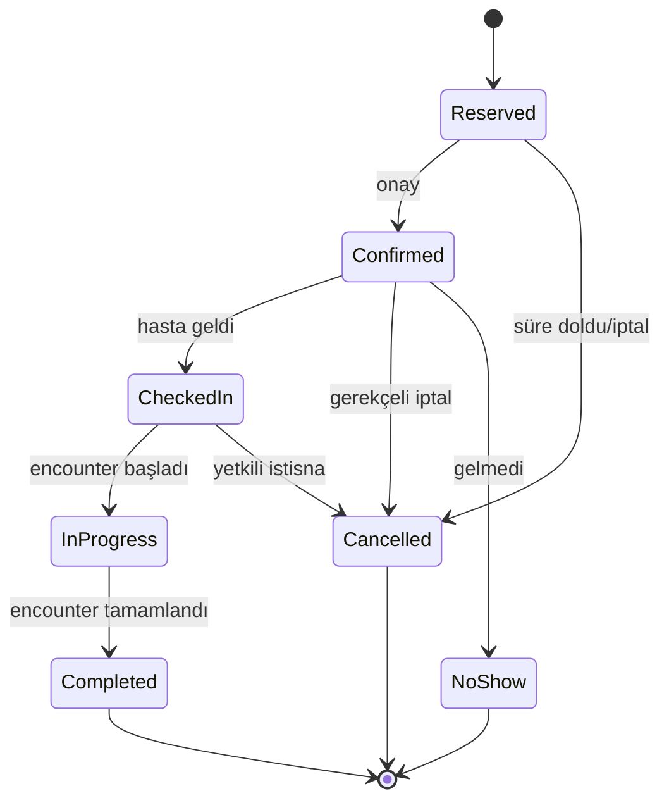
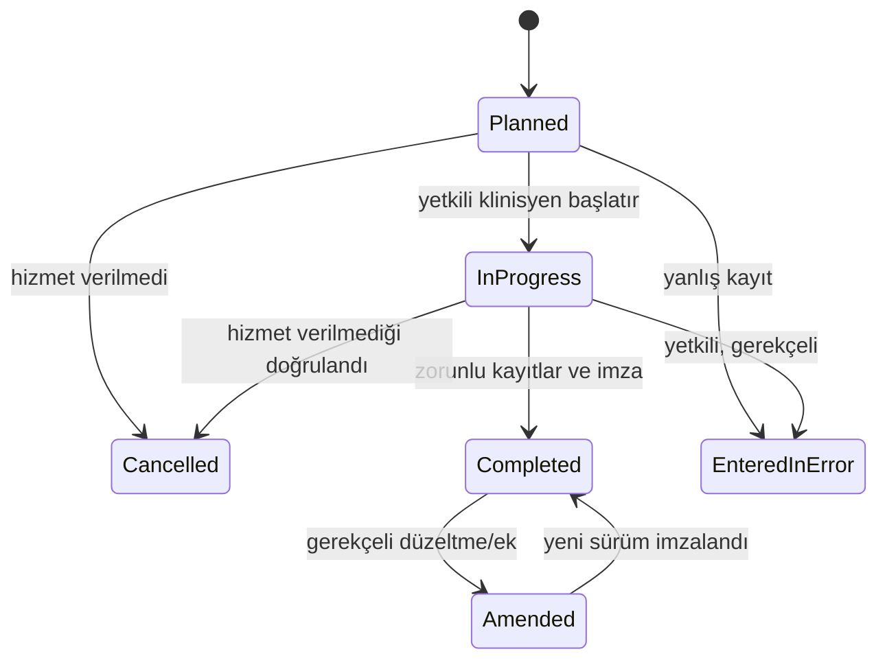
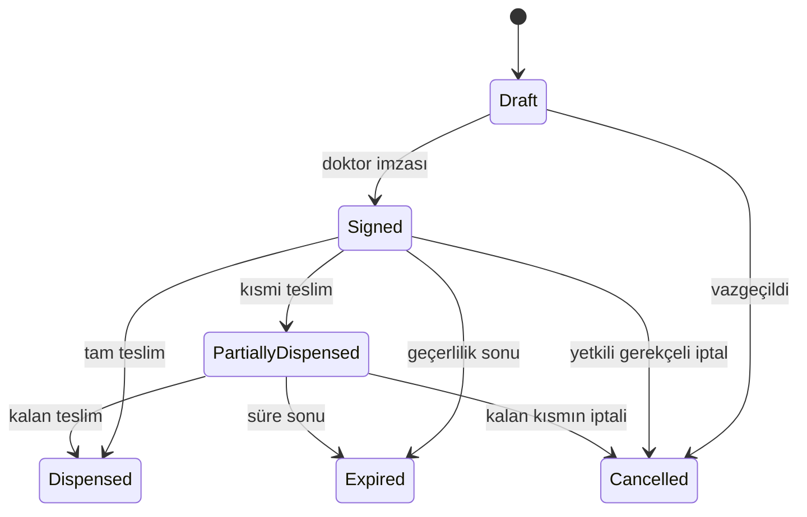
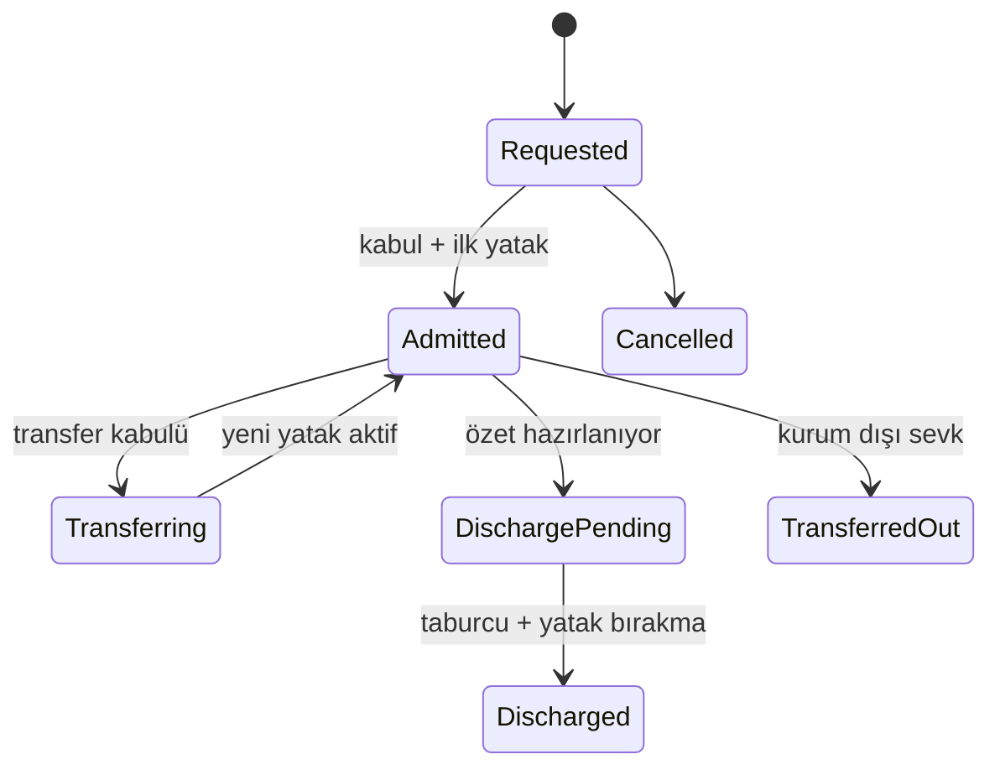

# Ana Durum Makineleri

## Ortak kurallar

- Durum geçişleri sunucu tarafında domain kuralıyla doğrulanır; UI seçeneği güvenlik sınırı değildir.
- Her geçiş aktör, UTC zaman, önceki/yeni durum ve gerekçeyle auditlenir.
- `cancelled` planın iptal edildiğini; `entered-in-error` kaydın hiç gerçekleşmemiş/hatalı olduğunu belirtir.
- İmzalı/final klinik içerik güncellenmez; yeni sürüm, düzeltme veya ek kayıt oluşturulur.
- Kritik geçişler optimistic concurrency ve idempotency anahtarıyla korunur.

## Randevu



Yasak örnekler: `Completed → Confirmed`, `Cancelled → CheckedIn`. Yeniden planlama eski randevuyu gerekçeli iptal eder ve yeni randevu oluşturur.

## Klinik karşılaşma



`Completed` içerik doğrudan düzenlenemez. Yeniden açma ayrı permission, gerekçe ve başhekim/policy kontrolü ister.

## Klinik not

```text
Draft → Signed → Addended
  └────→ EnteredInError
Signed ─→ Corrected (yeni sürüm) ─→ Signed
```

- `Draft`: Yazar ve yetkili eş-yazar değiştirebilir.
- `Signed`: Değişmez sürüm; ek/düzeltme gerekir.
- `Addended`: Orijinal + zaman damgalı ek not.
- `Corrected`: Eski sürüme referans veren yeni taslak/sürüm.
- `EnteredInError`: İçerik klinik görünümde geçersiz, audit/geçmişte korunur.

## Reçete ve teslim



Teslim kayıtları geri yazılarak silinmez; hatalı teslim için ters stok hareketi ve düzeltme kaydı gerekir.

## Klinik istem

```text
Draft → Active → InProgress → Completed
             ├→ Cancelled
             └→ OnHold → InProgress
Active/InProgress → EnteredInError (yetkili, gerekçeli)
```

Laboratuvar numunesi kabul edildikten veya görüntüleme çekimi başladıktan sonra iptal, ilgili alt modülün ek kurallarına tabidir.

## Numune

```text
Expected → Collected → Received → Accepted → InProcess → Completed
                └──────────────→ Rejected
Collected/Received/Accepted/InProcess → Lost (olay kaydı ve escalation)
```

Her geçiş gözetim zinciri kaydı üretir. `Rejected` numune yeniden aktif olmaz; yeni numune oluşturulur.

## Tanısal sonuç/rapor

```text
Preliminary → TechnicallyVerified → Final → Corrected Final
      └──────────────→ EnteredInError
```

Hasta portalı yalnızca yayın politikası izin veren `Final` veya `Corrected Final` sürümü görür. Kritik bayrak durum değil, ayrıca bildirimi gereken niteliktir.

## Yatış ve yatak ataması



Bir yatışta aynı anda tek aktif yatak ataması; bir yatakta aynı anda tek aktif yatış olabilir. Eski atama kapanmadan yeni atama açılamaz.

## Konsültasyon

```text
Requested → Accepted → InProgress → Completed
    ├→ Declined (gerekçe)
    └→ Cancelled (başlamadan)
```

## Acil başvuru

```text
Arrived → Triaged → Waiting → InAssessment → Observation
                                  ├→ Discharged
                                  ├→ Admitted
                                  ├→ TransferredOut
                                  └→ LeftWithoutBeingSeen
```

Triyaj seviyesi insan tarafından seçilen demo sınıflandırmadır; sistem otomatik tanı veya öncelik kararı üretmez.

## Audit olayı

Audit olayının durum makinesi yoktur: bir kez yazıldıktan sonra normal uygulama yollarıyla güncellenemez veya silinemez. Retention/imha politikası ayrı, ayrıcalıklı ve kanıt üreten süreçtir.
