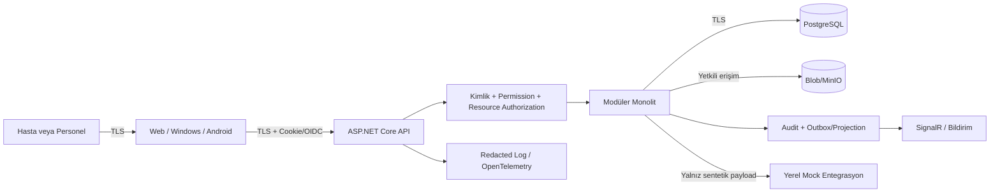

# Tehdit Modeli

## Kapsam ve güvenlik hedefi

Model; web/API, ileride Windows/Android istemcileri, PostgreSQL, blob depolama, SignalR, audit/telemetry, CI ve yerel mock entegrasyonları kapsar. Hedef, OWASP ASVS 5.0 Seviye 2 kontrollerini eğitim ürünü ölçeğinde karşılamak ve sağlık verisi için sıkı kaynak yetkilendirmesi uygulamaktır.

Kapsam dışı: gerçek hastane ağı/cihazı, gerçek dış kurum credential'ı, gerçek mobil push ve fiziksel bina güvenliği. Bunlar ileride eklenirse model yenilenir.

## Korunan varlıklar

| Varlık | Güvenlik hedefi |
|---|---|
| Hesap, oturum, MFA ve token | Gizlilik, bütünlük, iptal edilebilirlik |
| Hasta demografi ve klinik veri | Gizlilik, bütünlük, amaçla sınırlı erişim |
| İmzalı klinik kayıt ve sonuç | Bütünlük, kaynak/aktör inkâr edememe, sürüm geçmişi |
| Randevu, yatak, stok ve numune | Bütünlük, concurrency ve izlenebilirlik |
| Audit olayları | Append-only bütünlük, erişilebilirlik, minimizasyon |
| Encryption key ve secret | Gizlilik, ayrılık, rotation |
| Mock entegrasyon mesajı | Açık simülasyon etiketi, bütünlük, gerçek sisteme kaçmama |
| Kaynak kodu ve CI | Supply-chain bütünlüğü, secret'sız çalışma |
| Rapor/export | Kapsamlı gizlilik, süreli erişim |

## Güven sınırları ve veri akışı

Sınırlar: güvenilmeyen istemci–API, API–veri depoları, modül–modül sözleşmesi, uygulama–mock dış sistem, CI–artefact/secret ve kullanıcı–export dosyası.

## Tehdit aktörleri

- Kendi verisine erişen fakat başka hastanın kaydını hedefleyen hasta
- Geçerli hesabı olan fakat görev kapsamını aşan personel
- Rol/permission yanlış yapılandıran veya hesabı ele geçirilen yönetici
- Kötü amaçlı dış kullanıcı/bot
- Zararlı dosya veya bozuk entegrasyon payload'ı
- Savunmasız/ele geçirilmiş NuGet, container veya CI bağımlılığı
- Yanlış yönlendirilen AI geliştirme ajanı veya geliştirici hatası

## Risk ölçeği

- Olasılık: 1 düşük, 2 orta, 3 yüksek
- Etki: 1 sınırlı, 2 önemli, 3 kritik
- Skor = olasılık × etki; 6–9 yüksek, 3–4 orta, 1–2 düşük
- Açık yüksek risk faz kapısını engeller.

## STRIDE risk kaydı

| ID | STRIDE | Tehdit/saldırı yolu | O | E | Skor | Önleyici kontroller | Tespit/kanıt | Sahip/faz |
|---|---|---|---:|---:|---:|---|---|---|
| TM-01 | S | Credential stuffing, brute force, account enumeration | 3 | 3 | 9 | Güçlü parola, lockout/rate limit, nötr cevap, personel MFA | Başarısız giriş metriği/audit ve alarm eşiği | Identity/F2,F13 |
| TM-02 | S | Session fixation/çalıntı cookie/token | 2 | 3 | 6 | Secure/HttpOnly/SameSite cookie, session rotation, kısa token, PKCE/secure storage | Oturum oluşturma/iptal audit'i, anomali inceleme | Identity/F2,F12,F13 |
| TM-03 | E | Kullanıcının form/claim'e rol veya bölüm yazması | 3 | 3 | 9 | Server-side permission/resource handler, allow-list DTO, role atamada MFA | Deny audit, mass assignment testleri | Identity/F2,F13 |
| TM-04 | I/E | IDOR ile başka hastanın UUID'sine erişim | 3 | 3 | 9 | Her endpoint'te OWN/CARE_TEAM/ASSIGNED kontrolü, projection minimizasyonu | Negatif integration/E2E, erişim audit'i | Tüm modüller/F2+ |
| TM-05 | E | ADM rolünün klinik içeriğe veya DOC'un role erişmesi | 2 | 3 | 6 | Görev ayrılığı, klinik permission'ın ADM'de olmaması | Permission matris regresyonu | Identity/F2,F13 |
| TM-06 | T | İmzalı not/sonuç/reçetenin sessiz güncellenmesi | 2 | 3 | 6 | Durum makinesi, version/concurrency, düzeltme kaydı | Audit + eski/yeni sürüm testi | Clinical/F4-F6,F13 |
| TM-07 | T | Randevu/yatak/stok yarışında çift atama/negatif stok | 3 | 2 | 6 | DB constraint, transaction, optimistic concurrency, idempotency | Concurrency/yük testleri | Scheduling/Inpatient/Inventory |
| TM-08 | R | Kullanıcının hassas işlemi inkâr etmesi | 2 | 3 | 6 | Değişmez audit, UTC, aktör/hedef/sonuç/gerekçe | Audit bütünlük ve kurcalama kontrolü | Audit/F2,F13 |
| TM-09 | T/R | Audit satırının değiştirilmesi/silinmesi | 2 | 3 | 6 | Ayrı write API/izin, append-only DB kuralı, hash-chain değerlendirmesi, backup | Bütünlük doğrulama işi/alarm | Audit/F2,F13 |
| TM-10 | I | Log, trace, exception, URL veya metric içinde klinik veri | 3 | 3 | 9 | Redaction, body logging kapalı, şablon URL, güvenli exception sözleşmesi | Canary/sentetik marker sızıntı testi | Platform/F1,F13 |
| TM-11 | I | CSV/export ile toplu sızıntı veya formula injection | 2 | 3 | 6 | Export permission+MFA, satır sınırı, escaping, süreli link/dosya | Export audit, temizleme metriği | Reporting/F11,F13 |
| TM-12 | T/I | Zararlı dosya, path traversal, MIME sahteciliği | 2 | 3 | 6 | Rastgele storage key, allow-list, boyut, magic-byte, AV hook, yetkili proxy | Tarama/ret audit, negatif test | Clinical files/F4,F13 |
| TM-13 | I | SignalR grup adını göndererek başka bölüm verisi alma | 2 | 3 | 6 | Grup üyeliğini sunucu claim/kapsamdan hesaplama, hub authorization | Katılım/deny audit ve integration testi | Notifications/F3,F11,F13 |
| TM-14 | S/T | CSRF, XSS veya injection | 2 | 3 | 6 | Antiforgery, CSP/encoding, parameterized EF, input validation, güvenlik başlığı | SAST/DAST, ASVS test paketi | Platform/UI/F1,F13 |
| TM-15 | S/I | SSRF/open redirect ile iç ağa veya credential'a erişim | 2 | 3 | 6 | Dış URL allow-list, adapter sabit base URL, redirect validation | Egress log ve güvenlik testleri | Interop/F10,F13 |
| TM-16 | T/D | Bozuk/tekrarlı mock mesajın ana kaydı bozması | 2 | 2 | 4 | Schema/contract validation, idempotency, timeout/circuit, dead-letter | İşlem metriği ve hata listesi | Interop/F10 |
| TM-17 | I | Mock adaptörün gerçek endpoint/credential kabul etmesi | 2 | 3 | 6 | Demo allow-list, reserved domain, startup guard, belirgin MOCK etiketi | Config taraması ve startup test | Interop/F10,F13 |
| TM-18 | I | Secret'ın git, log, container image veya artefact'a girmesi | 2 | 3 | 6 | User-secrets/env/secret store, `.gitignore`, image layer disiplini | Secret scanning ve CI gate | Platform/F1,F13 |
| TM-19 | T/E | Zararlı bağımlılık/supply-chain | 2 | 3 | 6 | Central version pin, lock/verification, minimum paket, resmi image | Dependency/CVE/license scan | Platform/F1,F13 |
| TM-20 | D | Pahalı arama, login veya SignalR ile DoS | 3 | 2 | 6 | Rate limit, pagination, timeout, query index/budget, connection limit | Latency/error/resource metrikleri | Platform/Reporting/F13 |
| TM-21 | I | Backup/restore veya geçici export'un kalıcı sızıntısı | 2 | 3 | 6 | Şifreli/sınırlı backup, süreli export, ayrı erişim, retention | Yaş/temizleme metriği, restore audit | Privacy/F11,F13 |
| TM-22 | I | Mobil cihazda token/klinik verinin güvensiz saklanması | 2 | 3 | 6 | System browser+PKCE, secure storage, offline klinik cache yok | Platform smoke, cihaz kayıp senaryosu | Mobile/F12,F13 |
| TM-23 | I/T | AI ajanının gerçek veri eklemesi veya testi gevşetmesi | 2 | 3 | 6 | AGENTS/CLAUDE/Cursor kuralları, sentetik veri scanner, test kanıtı, diff review | CI ve roadmap ilerleme kanıtı | Repo/F0,F13 |
| TM-24 | I | Shoulder surfing/geniş yönetim ekranında gereksiz kimlik | 2 | 2 | 4 | Maskeleme, minimum kolon, DEIDENTIFIED dashboard, kısa oturum | UI inceleme/audit | UI/Reporting |
| TM-25 | T | Retention işinin yanlış kayıtları geri döndürülemez silmesi | 2 | 3 | 6 | Dry-run, policy version, batch/checkpoint, approval, backup restore provası | İmha kanıtı, sayı sapması alarmı | Privacy/F13 |
| TM-26 | S/I | Native yetkilendirme kodunun ele geçirilmesi (Code Interception) | 2 | 3 | 6 | PKCE S256 zorunluluğu (code_challenge_method=S256), loopback IP / private-use URI scheme izolasyonu | Başarısız/geçersiz code_verifier audit'i | Mobile/Windows/F12 |
| TM-27 | S/T | Çalınan refresh token'ın yeniden kullanılması (Refresh Token Abuse) | 2 | 3 | 6 | Refresh Token Rotation (RTR), Reuse Detection ile token ailesi iptali, kısa ömürlü access token | Token yenileme ve reuse anomalisi logları | Identity/F12 |
| TM-28 | S/I | Native callback açık yönlendirme (Open Redirect) / scheme hijacking | 2 | 3 | 6 | Sıkı Callback URI allowlist (`NativeCallbackUriValidator`), loopback ve yetkili şema doğrulayıcı | Geçersiz callback URI deneme logları | Mobile/Windows/F12 |

## Yüksek risk kontrol eşlemesi

| Yüksek risk | Önleyici kontrol | Tespit edici kontrol | Faz kapısı kanıtı |
|---|---|---|---|
| TM-01 hesap ele geçirme | MFA, rate limit, lockout | Başarısız giriş audit/metriği | F2 + F13 kimlik paketi |
| TM-03 rol/kapsam yükseltme | Server permission/resource handler | Deny audit ve mass assignment testi | F2 rol matrisi regresyonu |
| TM-04 IDOR | OWN/CARE_TEAM/ASSIGNED kontrolü | Negatif API/E2E ve erişim audit'i | Her klinik faz + F13 |
| TM-10 telemetry sızıntısı | Redaction/body logging yasağı | Sentetik canary marker taraması | F1 gözlemlenebilirlik + F13 |

## Güvenlik gereksinimleri

1. Tüm ağ trafiği production-benzeri modda TLS kullanır.
2. Personel MFA; yüksek risk işlemlerde step-up doğrulama gerekir.
3. Yetkilendirme API'de policy + resource handler ile yapılır.
4. Request entity'si doğrudan domain entity'ye bind edilmez; allow-list command kullanılır.
5. Klinik içerik uygulama loguna veya audit event'e kopyalanmaz.
6. İmzalı/final kayıt için correction/entered-in-error modeli zorunludur.
7. Dosya public bucket veya tahmin edilebilir path'te sunulmaz.
8. Dış adres kullanıcı girdisiyle serbest belirlenmez.
9. Secret repo ve database config'inden ayrı tutulur; rotation belgelenir.
10. Kritik/yüksek güvenlik bulgusu faz/yayın kapısını engeller.

## Kötüye kullanım senaryoları

- Hasta URL'deki `PatientId` değerini değiştirir.
- Doktor genel hasta aramasını toplu kayıt çıkarmak için kullanır.
- Eczacı reçete detayından encounter notu endpoint'ine geçer.
- Sistem yöneticisi kendine klinik permission ekler veya son ADM'yi siler.
- Kullanıcı imzalı nota eski `rowVersion` ile güncelleme gönderir.
- İki kullanıcı aynı son randevu slotu/yatak/lot için yarışır.
- Upload dosyasının uzantısı PDF, içeriği executable/script olur.
- CSV hücresi `=HYPERLINK(...)` ile başlar.
- İstemci SignalR hub'a başka bölüm grup adını yollar.
- Mock entegrasyon base URL'si metadata/internal/gerçek kurum adresine çevrilir.

## İnceleme tetikleyicileri

Şu değişikliklerde tehdit modeli güncellenir:

- Yeni rol, permission, klinik modül veya veri sınıfı
- Gerçek dış sistem, gerçek veri, AI/klinik karar desteği
- Kimlik/OIDC/token modelinde değişiklik
- Yeni dosya türü, export, mobil offline cache veya bildirim kanalı
- Mikroservis, mesaj broker'ı, Redis veya yeni cloud altyapısı
- Yüksek güvenlik bulgusu veya veri olayı

## Kaynak

- [OWASP ASVS 5.0](https://owasp.org/www-project-application-security-verification-standard/)
- [KVKK — Özel Nitelikli Kişisel Verilerin İşlenmesine İlişkin Rehber](https://www.kvkk.gov.tr/Icerik/8183/Ozel-Nitelikli-Kisisel-Verilerin-Islenmesine-Iliskin-Rehber)

Bu model 13 Ağustos 2026 itibarıyla tasarım girdisidir ve hukuki/klinik sertifikasyon değildir.
